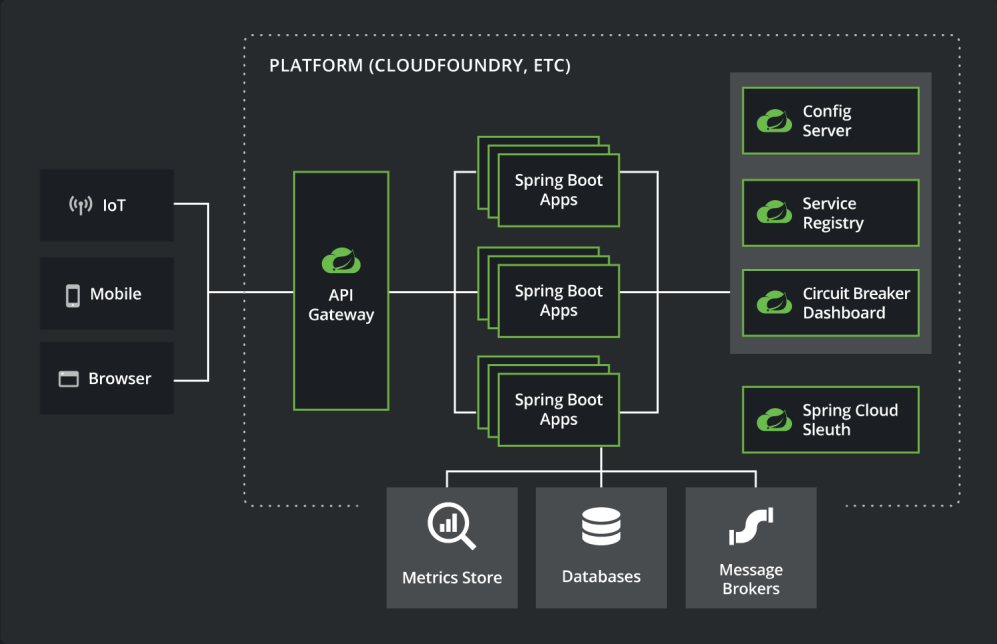
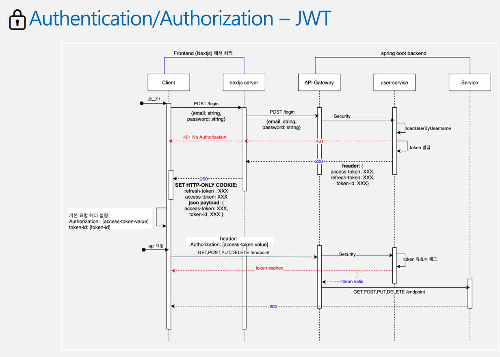
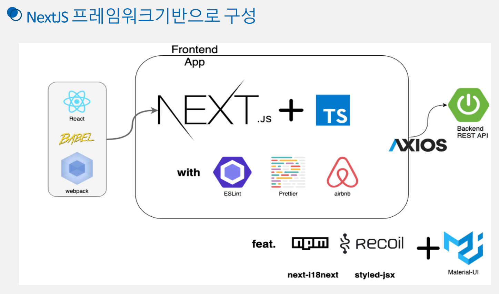
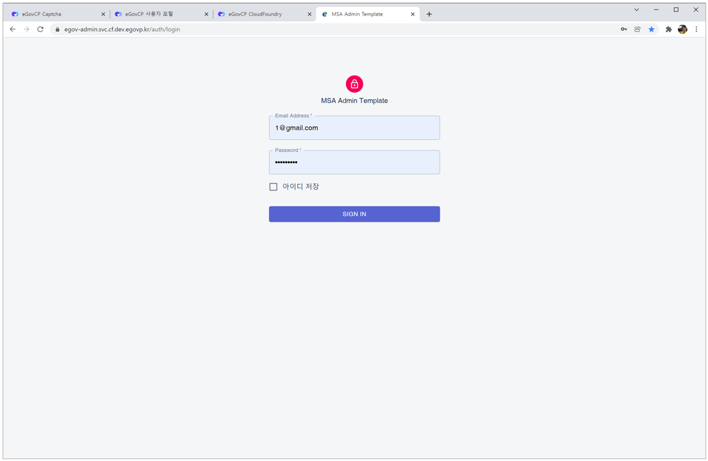
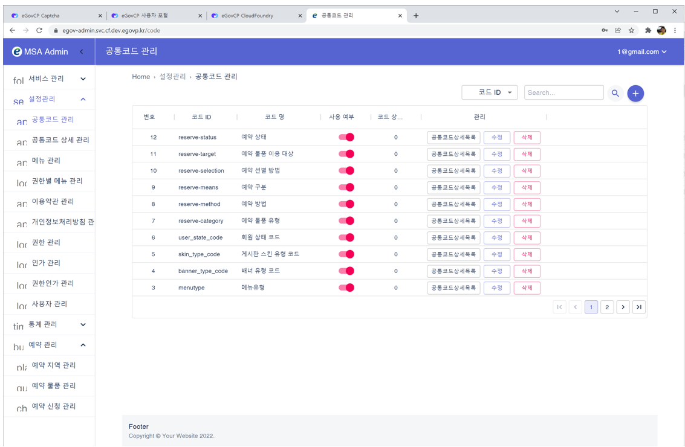

# MSA templates (for training)


This is the training source code for the Microservices Architecture (MSA) template created as part of the "Supporting the Spread of Cloud-Native Administrative and Public Services (2021)" project.

## Directory structure

```
├─backend
│  ├─apigateway
│  ├─board-service
│  ├─config
│  ├─discovery
│  ├─module-common
│  ├─portal-service
│  ├─reserve-check-service
│  ├─reserve-item-service
│  ├─reserve-request-service
│  └─user-service
├─config
├─docker-compose
│  ├─app
│  │  ├─mesh
│  │  └─service
│  ├─elk
│  │  ├─kibana
│  │  │  └─config
│  │  └─logstash
│  │      ├─config
│  │      └─pipeline
│  ├─mysql
│  │  └─init
│  └─opensearch
│      └─logstash
│          ├─config
│          └─pipeline
├─frontend
│  ├─admin
│  │  ├─public
│  │  │  ├─images
│  │  │  └─locales
│  │  ├─server
│  │  ├─src
│  │  │  ├─@types
│  │  │  ├─components
│  │  │  ├─constants
│  │  │  ├─hooks
│  │  │  ├─libs
│  │  │  ├─pages
│  │  │  ├─service
│  │  │  ├─stores
│  │  │  ├─styles
│  │  │  └─utils
│  │  └─test
│  ├─portal
│  │  ├─public
│  │  │  ├─locales
│  │  │  └─styles
│  │  ├─src
│  │  │  ├─@types
│  │  │  ├─components
│  │  │  ├─constants
│  │  │  ├─hooks
│  │  │  ├─libs
│  │  │  │  └─Storage
│  │  │  ├─pages
│  │  │  ├─service
│  │  │  ├─stores
│  │  │  ├─styles
│  │  │  └─utils
│  │  └─test
│  └─practice-image
└─k8s
    ├─applications
    │  ├─backend
    │  │  ├─apigateway
    │  │  │  └─ingress
    │  │  ├─board-service
    │  │  ├─config
    │  │  ├─discovery
    │  │  │  └─ingress
    │  │  ├─portal-service
    │  │  ├─reserve-check-service
    │  │  ├─reserve-item-service
    │  │  ├─reserve-request-service
    │  │  └─user-service
    │  └─frontend
    │      ├─admin
    │      │  └─ingress
    │      └─portal
    │          └─ingress
    └─environments
        ├─configmaps
        ├─databases
        │  └─mysql
        │      └─init
        ├─jenkins
        ├─logging
        │  └─elk
        │      ├─elasticsearch
        │      ├─kibana
        │      │  └─ingress
        │      └─logstash
        ├─nfs
        ├─rabbitmq
        │  └─ingress
        ├─storage
        ├─vagrant
        └─zipkin
            └─ingress
```

### Contents

- `/backend`: Services on the backend based on Spring Boot
- `/backend/apigateway`: API management and monitoring service for microservices (service mesh)
- `/backend/board-service`: Bulletin Board Service (Manage boards, posts, and attachments)
- `/backend/config`: Provide environment-independent services by offering separate, unified configuration management services (service mesh)
- `/backend/discovery`: Register and manage microservices and find and invoke them on demand (service mesh)
- `/backend/user-service`: User services (login, sign up, forgot password, admin)
- `/backend/portal-service`: Portal common services (menu, code, content, permissions, authorizations, banners, attachment management)
- `/backend/reserve-check-service`: Reservation Confirmation Service (non-blocking)
- `/backend/reserve-item-service`: Reserved Item Service (non-blocking)
- `/backend/reserve-request-service`: Reservation Request Service (non-blocking)
- `/config`: A folder containing a collection of configuration YAML files used by the CONFIG server in the backend.
- `/docker-compose`: YAML configuration files to manage the running of multiple containers in Docker
- `/frontend/admin`: Admin Dashboard built with Next.js + Typescript + Material UI.
- `/frontend/portal`: React based frontend built with Next.js + Typescript.
- `/frontend/practice-image`: Banner images
- `/k8s`: Resource template yaml file for deploying to a Kubernetes environment
- `/k8s/applications`: K8s Resource template yaml files for the backend and frontend applications
- `/k8s/environments/configmaps`: objects stored as key-value pairs as environment variables used by Pods.
- `/k8s/environments/databases`: MySQL-related objects
- `/k8s/environments/jenkins`: Jenkins-related objects
- `/k8s/environments/logging`: ELK-specific objects for Centralized Logging
- `/k8s/environments/nfs`: NFS Node Volumes Configuration
- `/k8s/environments/rabbitmq`: Message Broker-related objects
- `/k8s/environments/storage`: PersistentVolumeClaim objects
- `/k8s/environments/vagrant`: Vagrant-specific definitions that make it easy to configure the creation of a virtualized software development environment
- `/k8s/environments/zipkin`: Zipkin-specific definitions for distributed transaction tracing

## How to run backend

- Run the Eclipse IDE in your development environment.
- From the Eclipse IDE menu, click File>Import....
- In the Import window that opens, select Gradle>Existing Gradle Project
- Click Next when the Import Gradle Project window opens.
- Select ${home}/workspace.edu/egovframe-msa-edu/backend/config from the project root directory and click the Finish button.
- Repeat the above to import the following projects (1-6 for small, 1-9 for large).

1. config
2. discovery
3. apigateway
4. user-service
5. portal-service
6. board-service
7. reserve-check-service
8. reserve-item-service
9. reserve-request-service

- After importing all the projects and checking the Project Explorer, the board-service, portal-service, and user-service projects show errors. You need to add the classes that are generated by querydsl to the build path.
- Click Window>Show View>Other, select Gradle>Gradle Tasks in the opened window, and click the Open button to open the Gradle Tasks tab.
- Click the View Menu button in the top right corner of Gradle Tasks and check Show All Tasks.
- In Gradle Tasks, double-click portal-service>other>compileQuerydsl or right-click and click Run Gradle Tasks to start the build.
- In the Project Explorer, select board-service, portal-service, user-service, and press F5 or right-click and click Refresh to refresh the project.
- In Project Explorer, right-click the board-service, portal-service, or user-service, and then click Properties.
- In the Properties window that opens, select Java Build Path from the left menu and click the Add Folder... button on the right Source tab.
- In the Source Folder Selection window that opens, check build>generated>querydsl and click the OK button.
- When you click the Apply and Close button in the Properties window, the window closes and the project rebuilds and the error message disappears.

(For more information about ELK configuration, Config, OAuth 2.0 setup, API call and JUnit Test, please refer to [02.MSA template backend configuration and practice(KOR).pdf](https://github.com/eGovFramework/egovframe-msa-edu/files/11084631/02.MSA._.pdf).)

## How to run frontend

```
node : 14.8.0
npm : 6.14.7
Visual Studio Code : latest
```

- Download and install from https://nodejs.org/en/download and check the version.

```
node -v
npm -v
```

- In Visual Studio Code, open the frontend/admin folder.
- In a terminal, run the following

```
npm install
npm run dev
```

- On the login screen, enter '1@gmail.com' in the email field and 'test1234!' in the password field to log in.

(For more information, please refer to [03.MSA template frontend configuration and practice(KOR).pdf](https://github.com/eGovFramework/egovframe-msa-edu/files/11084632/03.MSA._.pdf).)

## Screenshots reference







## Training materials

Only available in Korean.
- [01.MSA template overview and development environment practice(KOR).pdf](https://github.com/eGovFramework/egovframe-msa-edu/files/11084628/01.MSA._._.pdf)
- [01.MSA Template Overview and Development Environment Theory(KOR).pdf](https://github.com/eGovFramework/egovframe-msa-edu/files/11084629/01.MSA._._.pdf)
- [02.MSA template backend configuration and practice(KOR).pdf](https://github.com/eGovFramework/egovframe-msa-edu/files/11084631/02.MSA._.pdf)
- [03.MSA template frontend configuration and practice(KOR).pdf](https://github.com/eGovFramework/egovframe-msa-edu/files/11084632/03.MSA._.pdf)
- [04.MSA template event stream configuration and practice(KOR).pdf](https://github.com/eGovFramework/egovframe-msa-edu/files/11084633/04.MSA._.pdf)