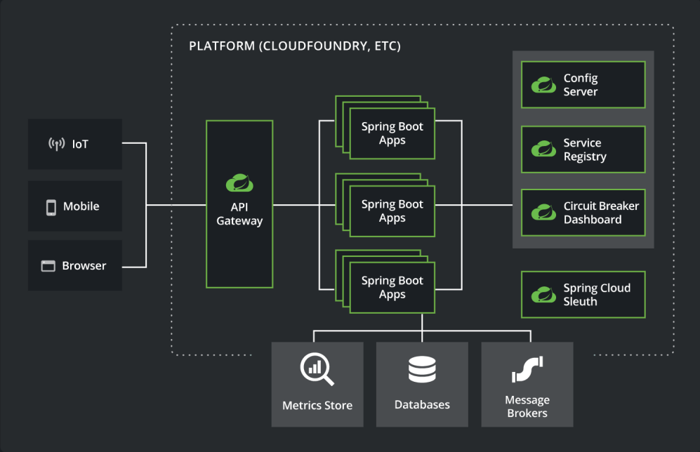
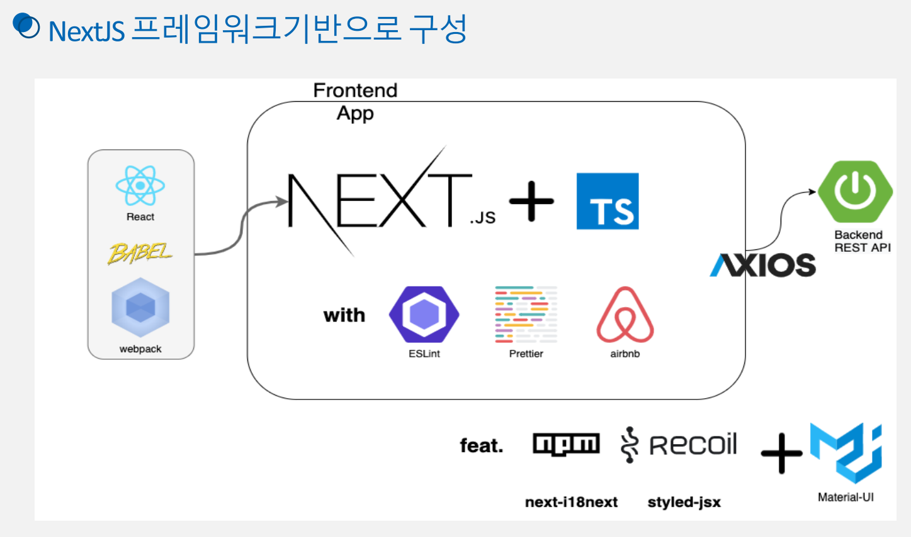
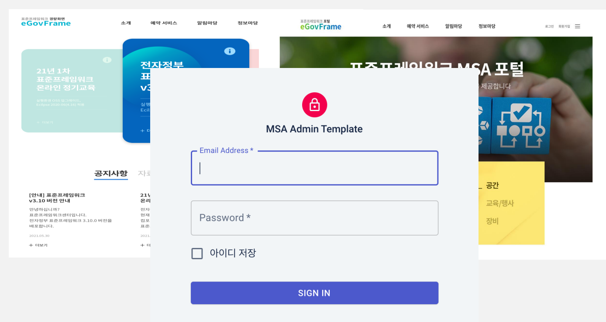
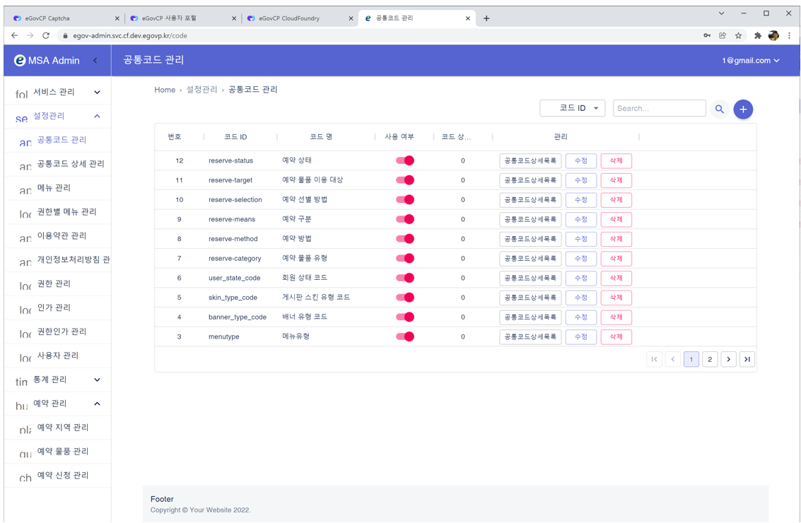

# MSA 템플릿 (교육용)


'클라우드 네이티브 기반 행정·공공 서비스 확산 지원(2021)' 사업의 일환으로 제작된 MSA(Microservices Architecture) 템플릿의 교육 소스코드이다.

## 디렉토리 구조

```
├─backend
│  ├─apigateway
│  ├─board-service
│  ├─config
│  ├─discovery
│  ├─module-common
│  ├─portal-service
│  ├─reserve-check-service
│  ├─reserve-item-service
│  ├─reserve-request-service
│  └─user-service
├─config
├─docker-compose
│  ├─app
│  │  ├─mesh
│  │  └─service
│  ├─elk
│  │  ├─kibana
│  │  │  └─config
│  │  └─logstash
│  │      ├─config
│  │      └─pipeline
│  ├─mysql
│  │  └─init
│  └─opensearch
│      └─logstash
│          ├─config
│          └─pipeline
├─frontend
│  ├─admin
│  │  ├─public
│  │  │  ├─images
│  │  │  └─locales
│  │  ├─server
│  │  ├─src
│  │  │  ├─@types
│  │  │  ├─components
│  │  │  ├─constants
│  │  │  ├─hooks
│  │  │  ├─libs
│  │  │  ├─pages
│  │  │  ├─service
│  │  │  ├─stores
│  │  │  ├─styles
│  │  │  └─utils
│  │  └─test
│  ├─portal
│  │  ├─public
│  │  │  ├─locales
│  │  │  └─styles
│  │  ├─src
│  │  │  ├─@types
│  │  │  ├─components
│  │  │  ├─constants
│  │  │  ├─hooks
│  │  │  ├─libs
│  │  │  │  └─Storage
│  │  │  ├─pages
│  │  │  ├─service
│  │  │  ├─stores
│  │  │  ├─styles
│  │  │  └─utils
│  │  └─test
│  └─practice-image
└─k8s
    ├─applications
    │  ├─backend
    │  │  ├─apigateway
    │  │  │  └─ingress
    │  │  ├─board-service
    │  │  ├─config
    │  │  ├─discovery
    │  │  │  └─ingress
    │  │  ├─portal-service
    │  │  ├─reserve-check-service
    │  │  ├─reserve-item-service
    │  │  ├─reserve-request-service
    │  │  └─user-service
    │  └─frontend
    │      ├─admin
    │      │  └─ingress
    │      └─portal
    │          └─ingress
    └─environments
        ├─configmaps
        ├─databases
        │  └─mysql
        │      └─init
        ├─jenkins
        ├─logging
        │  └─elk
        │      ├─elasticsearch
        │      ├─kibana
        │      │  └─ingress
        │      └─logstash
        ├─nfs
        ├─rabbitmq
        │  └─ingress
        ├─storage
        ├─vagrant
        └─zipkin
            └─ingress
```

### 디렉토리 설명

- `/backend`: Spring Boot를 기반으로 백앤드에 올려지는 서비스들
- `/backend/apigateway`: Microservice에 대한 API 관리 및 모니터링 서비스
- `/backend/board-service`: 게시판 서비스 (게시판, 게시물, 첨부파일 관리)
- `/backend/config`: 별도의 통합된 설정 관리 서비스 제공을 통해 환경 독립적 서비스 제공
- `/backend/discovery`: 마이크로서비스들을 등록하여 관리하고 요청 시 해당 서비스를 찾아 호출
- `/backend/user-service`: 사용자 서비스 (로그인, 회원가입, 비밀번호 찾기, 관리자)
- `/backend/portal-service`: 포털 공통 서비스 (메뉴, 코드, 컨텐츠, 권한, 인가, 배너, 첨부파일 관리)
- `/backend/reserve-check-service`: 예약 확인 서비스
- `/backend/reserve-item-service`: 예약 물품 서비스
- `/backend/reserve-request-service`: 예약 신청 서비스
- `/config`: backend 의 config 서버에서 사용하는 설정 yaml 파일 모음 폴더
- `/docker-compose`: Docker에 여러 컨테이너의 실행을 관리하는 yaml 구성 파일들
- `/frontend/admin`: Next.js + Typescript + Material UI 활용한 Admin Dashboard.
- `/frontend/portal`: Next.js + Typescript 활용한 React 기반 프론트엔드.
- `/frontend/practice-image`: 배너 이미지
- `/k8s`: Kubernetes 환경 배포를 위한 Resource 템플릿 yaml 파일
- `/k8s/applications`: Backend와 Frontend 애플리케이션의 k8s Resource 템플릿 yaml 파일
- `/k8s/environments/configmaps`: Pods에서 사용하는 환경변수로서 Key-Value 쌍의 형태로 저장된 객체 정의
- `/k8s/environments/databases`: MySQL 관련 객체 정의
- `/k8s/environments/jenkins`: Jenkins 관련 객체 정의
- `/k8s/environments/logging`: Centralized Logging을 위한 ELK 관련 객체 정의
- `/k8s/environments/nfs`: NFS 노드 볼륨 구성
- `/k8s/environments/rabbitmq`: Message Broker 관련 객체 정의
- `/k8s/environments/storage`: PersistentVolumeClaim 정의
- `/k8s/environments/vagrant`: 가상화 소프트웨어 개발환경의 생성을 쉽게 구성하도록 하는 Vagrant 관련 정의
- `/k8s/environments/zipkin`: 분산 트랜잭션 추적을 위한 Zipkin 관련 정의

## 백앤드 구동 방법

- 개발환경 Eclipse IDE 를 실행한다.
- Eclipse IDE 메뉴에서 File>Import… 를 클릭한다.
- Import 창이 열리면 Gradle>Existing Gradle Project 를 선택하고 Next 버튼을 클릭한다.
- Import Gradle Project 창이 열리면 Next 버튼을 클릭한다.
- Project root directory 에서 ${home}/workspace.edu/egovframe-msa-edu/backend/config를 선택하고 Finish 버튼을 클릭한다.
- 위의 과정을 반복하여 아래의 프로젝트를 import 한다. (소규모는 1-6, 대규모는 1-9)

1. config
2. discovery
3. apigateway
4. user-service
5. portal-service
6. board-service
7. reserve-check-service
8. reserve-item-service
9. reserve-request-service

- 모든 프로젝트를 import 하고 Project Explorer 를 확인하면 board-service, portal-service, user-service 프로젝트에 오류 표시가 출력된다. querydsl 로 generate 되는 클래스들을 build path 에 추가해야 한다.
- Window>Show View>Other 을 클릭해서 열린 창에서 Gradle>Gradle Tasks 를 선택하고 Open 버튼을 클릭하면 Gradle Tasks 탭이 열린다.
- Gradle Tasks 오른쪽 윗부분의 View Menu 버튼을 클릭해서 Show All Tasks 를 체크한다.
- Gradle Tasks 에서 portal-service>other>compileQuerydsl 을 더블클릭 또는 우클릭 후 Run Gradle Tasks 를 클릭하면 build 가 시작된다.
- Project Explorer 에서 board-service, portal-service, user-service 를 선택하고 F5 또는 우클릭 후 Refresh 를 클릭해서 프로젝트를 새로고침한다.
- Project Explorer 에서 board-service, portal-service, user-service 를 우클릭하고 Properties 를 클릭한다.
- Properties 창이 열리면 왼쪽 메뉴에서 Java Build Path를 선택하고 오른쪽 Source 탭에서 Add Folder… 버튼을 클릭한다.
- Source Folder Selection 창이 열리면 build>generated>querydsl 을 체크하고 OK 버튼을 클릭한다.
- Properties 창에서 Apply and Close 버튼을 클릭하면 창이 닫히면서 프로젝트를 다시 빌드하고 오류 표시는 사라진다.

(ELK 설정, Config 설정, OAuth 2.0 설정, API 호출 및 JUnit 테스트 관련해서는 [02.MSA템플릿 백엔드구성 및 실습.pdf](https://github.com/eGovFramework/egovframe-msa-edu/files/11084631/02.MSA._.pdf) 파일을 참조한다.)

## 프론트앤드 구동 방법

```
node : 14.8.0
npm : 6.14.7
Visual Studio Code : latest
```

- https://nodejs.org/en/download 에서 다운로드 후 설치하고 버전을 확인한다.

```
node -v
npm -v
```

- Visual Studio Code 에서 frontend/admin 폴더를 연다.
- Terminal 에서 다음을 실행한다.

```
npm install
npm run dev
```

- 로그인 화면에서 email 란에 '1@gmail.com', password 란에 'test1234!' 입력 후 로그인한다.

(기타 상세한 내용은 [03.MSA템플릿 프론트엔드구성 및 실습.pdf](https://github.com/eGovFramework/egovframe-msa-edu/files/11084632/03.MSA._.pdf) 파일을 참조한다.)

## 참조 화면







## 교육 교재

- [01.MSA템플릿 개요 및 개발환경 실습.pdf](https://github.com/eGovFramework/egovframe-msa-edu/files/11084628/01.MSA._._.pdf)
- [01.MSA템플릿 개요 및 개발환경 이론.pdf](https://github.com/eGovFramework/egovframe-msa-edu/files/11084629/01.MSA._._.pdf)
- [02.MSA템플릿 백엔드구성 및 실습.pdf](https://github.com/eGovFramework/egovframe-msa-edu/files/11084631/02.MSA._.pdf)
- [03.MSA템플릿 프론트엔드구성 및 실습.pdf](https://github.com/eGovFramework/egovframe-msa-edu/files/11084632/03.MSA._.pdf)
- [04.MSA템플릿 이벤트스트림구성 및 실습.pdf](https://github.com/eGovFramework/egovframe-msa-edu/files/11084633/04.MSA._.pdf)