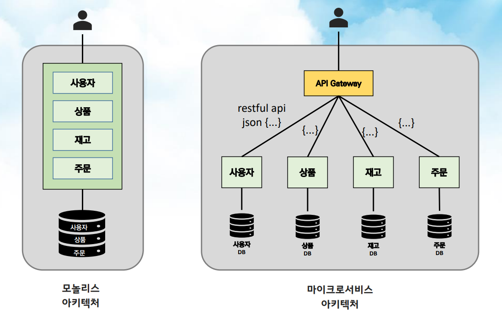
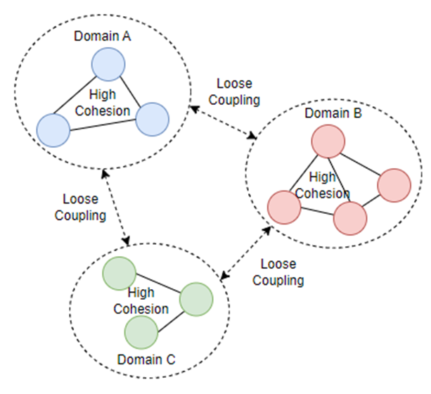
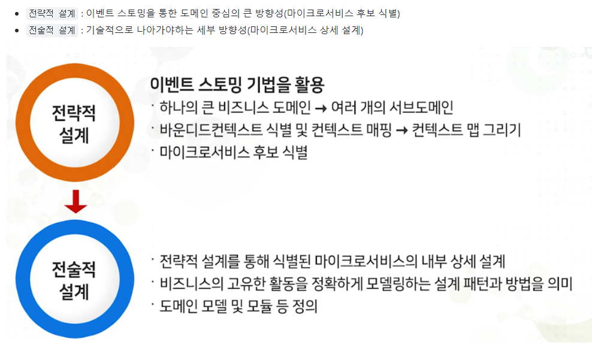
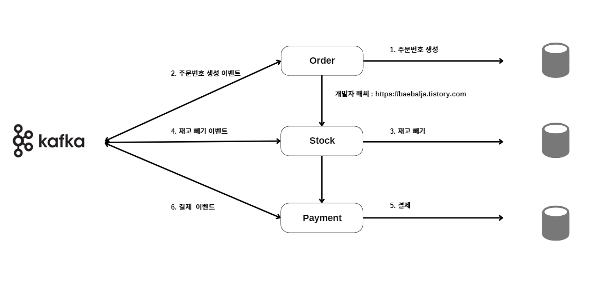
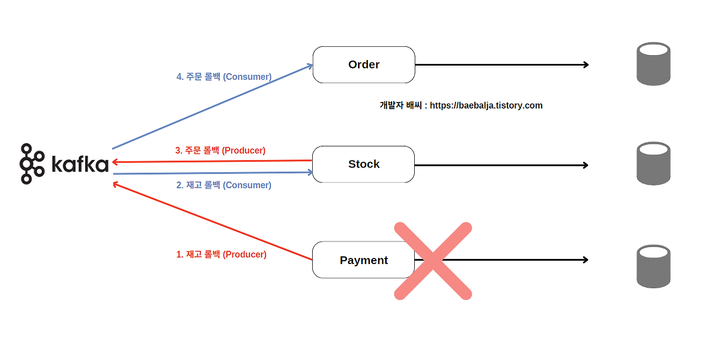
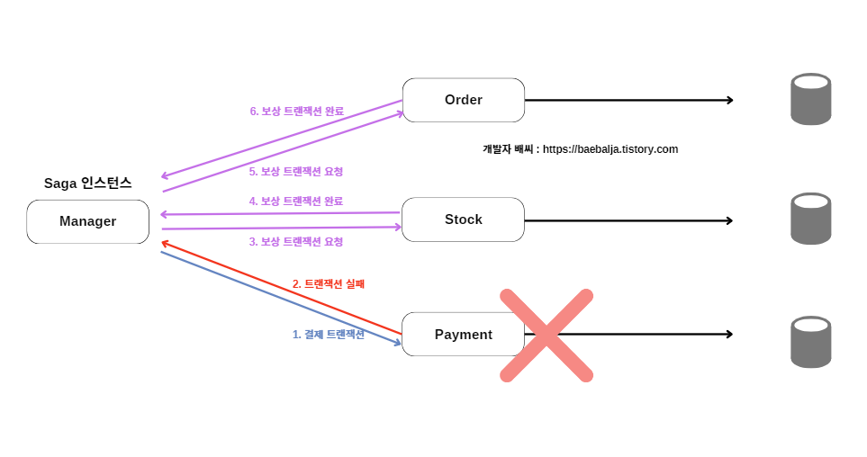

# MSA (MicroService Architecture)
- 하나의 애플리케이션을 작고 독립적인 서비스로 나누어 개발
- 각 서비스는 자체 데이터베이스를 가지고 있음
- 서비스 분리는 각 서비스가 비즈니스 요구에 맞춰 독립적으로 확장 가능하고, 유지보수가 용이하도록 설계하는 것이 목표
- 개발부터 배포까지 효율적으로 수행 가능 -> 기업이 개발 및 유지보수에 소요되는 시간과 비용을 줄이는 데 도움

## 단위 서비스로 쪼개기
- 기업의 목표에 맞춰 적절한 서비스 크기를 결정하고 검증
- 충분히 독립적이면서도 지나치게 작거나 커서 관리가 어려워지지 않도록 적절한 크기로 분리

# DDD (Domain Driven Design)
- MSA 서비스 분리의 논리적 기준 제시
- 서비스 간 느슨한 결합(Loose Coupling)과 높은 응집력(High Cohesion) 유지하면서, 각 서비스가 단일 목적의 기능을 수행하도록 분리하기 위해 관련 기능을 모아 하나의 도메인으로 묶음
- MSA에서 이러한 도메인 구분은 서비스 분리의 기준 -> 도메인을 잘못 나누면 MSA 어려움을 초래할 수 있으므로, 적절한 도메인 설계가 중요

## 전략적 설계와 전술적 설계

### 전략적 설계 (Strategic Design)
MSA에서 각 서비스를 어떤 기준으로 분리할지에 대한 큰 틀을 결정하는 단계, Bounded Context를 정의하고, 서비스 간 경계를 설정

- **Bounded Context**: 도메인 경계를 명확히 하여 서비스가 독립적으로 운영되도록 돕는 개념, 이를 통해 서비스 간 결합을 줄이고 응집력을 높일 수 있음

출처:https://it-noongam.tistory.com/20
### 전술적 설계 (Tactical Design)
각 서비스 내부의 구체적인 비즈니스 로직을 구체적으로 구현하는 단계

## 서브 도메인

하나의 큰 도메인을 여러 개의 서브 도메인으로 나누어 비즈니스 복잡성을 줄이고 각 서브 도메인을 독립적으로 관리

- **핵심 도메인**: 핵심 기능
- **지원 도메인**: 핵심은 아니지만 중요한 기능
- **일반 도메인**: 중요하지 않은 기능

출처:https://it-noongam.tistory.com/20

## DDD와 MSA의 결합

각 도메인이 독립된 서비스로 분리되고, 비즈니스 로직이 각 서비스 내에서 처리됨.  
각 서비스는 독립적으로 배포 및 확장 가능, 비즈니스 변화에 유연하게 대응 가능

## 데이터 일관성 및 트랜잭션 관리

MSA에서는 여러 서비스가 독립적인 데이터베이스를 가지고 있기 때문에 전통적인 트랜잭션 처리 방식이 어렵습니다. 이를 해결하기 위해 **Saga 패턴**과 **이벤트 소싱** 같은 분산 트랜잭션 관리 패턴이 사용됩니다.

- **Saga 패턴**: 여러 서비스에 걸쳐 발생하는 트랜잭션을 순차적으로 처리하고, 중간에 실패할 경우 보상 트랜잭션을 통해 롤백하는 방식.

Choreography based SAGA pattern

Choreography based SAGA pattern(실패 시)

Orchestration based SAGA pattern

- **이벤트 소싱**: 상태 변경을 이벤트로 저장하고, 이 이벤트 로그를 기반으로 시스템의 상태를 재구성하는 방식.

## 서비스 간 통신

각 서비스는 비즈니스 로직을 독립적으로 처리하되, 필요한 경우 다른 서비스와 통신해야 함

- **동기식 통신**: REST API로 구현이 쉽지만, 서비스 간 결합도가 높아질 수 있음
- **비동기식 통신**: 서비스가 독립적으로 동작하므로, 서비스 간 결합도가 낮음, 이벤트 기반 통신 사용
  - **이벤트 기반 통신**: 한 서비스에서 발생한 이벤트를 다른 서비스에 비동기적으로 전달하는 방식

서비스의 특성과 요구 사항을 고려하여 가장 적합한 통신 방법을 선택하는 것이 중요

## 참고
- [삼성 SDS Insight](https://www.samsungsds.com/kr/insights/1239180_4627.html)
- [LG CNS Blog](https://www.lgcns.com/blog/cns-tech/36171/)
- [Techblue](http://www.techblue.co.kr/?page_id=54395)
- [Kurly Helloworld Blog](https://helloworld.kurly.com/blog/ddd-msa-service-development/)
- [Velog](https://velog.io/@heoseungyeon/MSA-%EC%99%80-DDD-2-DDD%EB%A5%BC-%ED%99%9C%EC%9A%A9%ED%95%9C-MSA)
- [F-Lab Insight](https://f-lab.kr/insight/communication-methods-in-msa)
- [NoonGam - MSA 이론 정리](https://it-noongam.tistory.com/20)