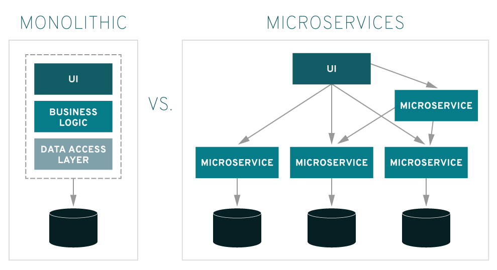
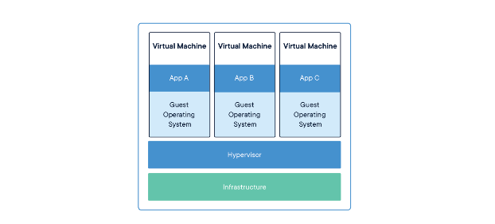
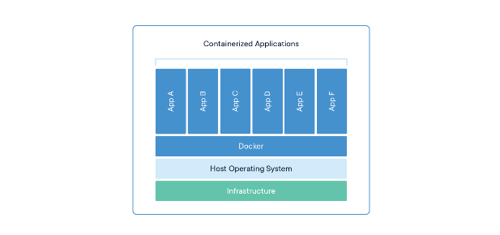
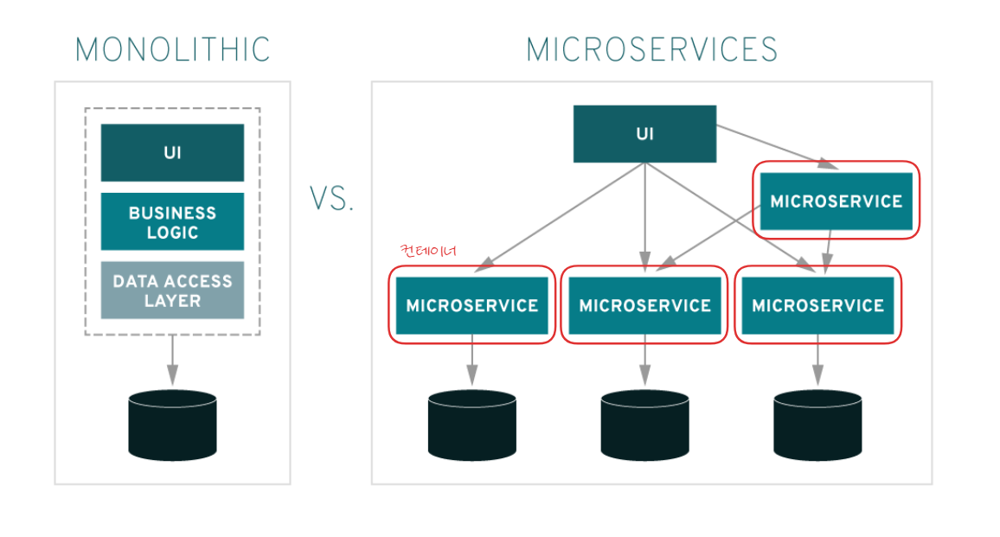
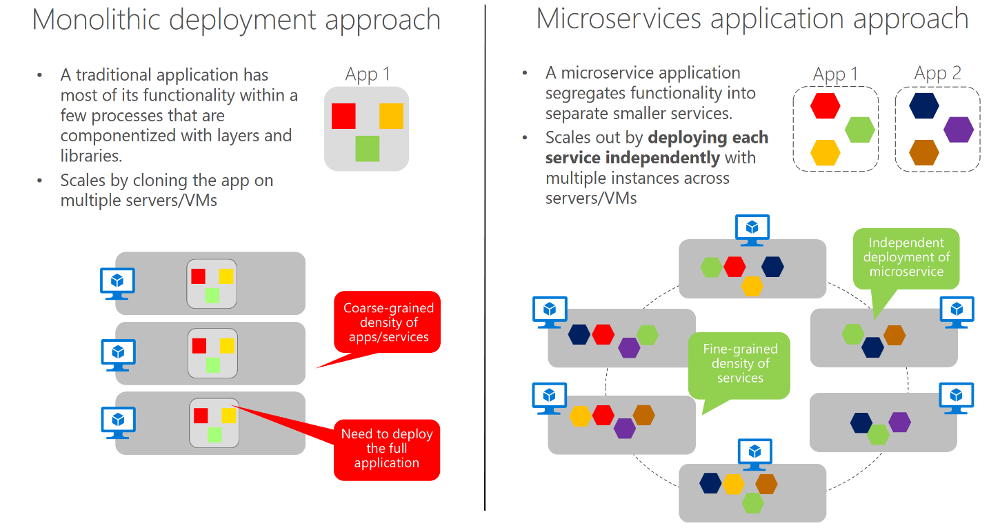
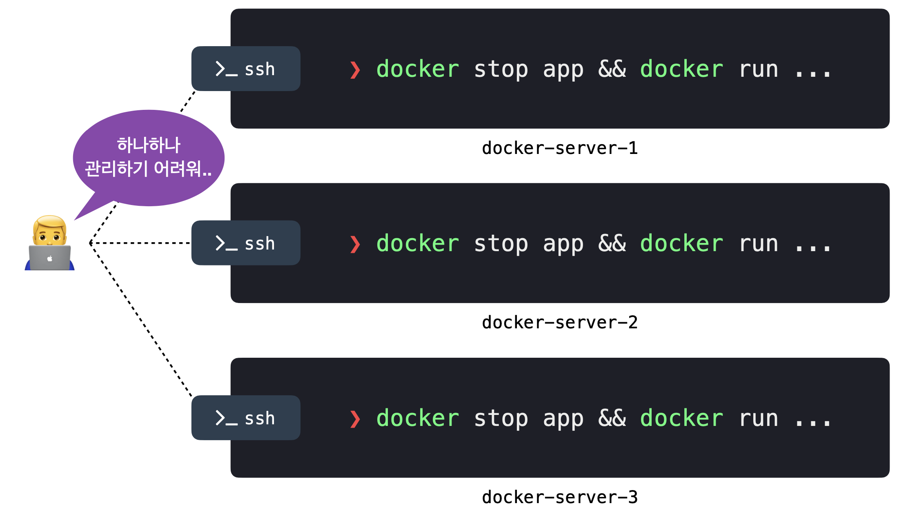

# 컨테이너화

- [1. 의도](#1-의도)
  - [1.1 MSA의 필요성](#11-msa의-필요성)
  - [1.2 MSA의 도입과 함께 발생하는 문제](#12-msa의-도입과-함께-발생하는-문제)
  - [1.3 컨테이너화의 필요성](#13-컨테이너화의-필요성)
- [2. 문제](#2-문제)
  - [2.1 상황 가정](#21-상황-가정)
  - [2.2 가상화 개념](#22-가상화-개념)
  - [2.3 서버 가상화](#23-서버-가상화)
- [3. 해결법 ](#3-해결법)
  - [3.1 컨테이너 기반 가상화](#31-컨테이너-기반-가상화)
  - [3.2 MSA에서의 컨테이너화](#32-msa에서의-컨테이너화)
- [4. 아키텍처 구조 ](#4-아키텍처-구조)
- [5. 장단점](#5-장단점)
  - [5.1 장점](#51-장점)
  - [5.2 단점](#52-단점)
- [6. 다른 기술과의 관계](#6-다른-기술과의-관계)
  - [6.1 클라우드 네이티브 아키텍처](#61-클라우드-네이티브-아키텍처)
  - [6.2 컨테이너 오케스트레이션](#62-컨테이너-오케스트레이션)
  - [6.3 서버리스와 컨테이너화의 융합](#63-서버리스와-컨테이너화의-융합)
- [참고자료](#참고-자료)

## 1. 의도

### 1.1 MSA의 필요성

오늘날 많은 기업들이 모놀리식 아키텍처의 한계를 극복하기 위해 마이크로서비스 아키텍처(MSA)를 채택하고 있습니다.

모놀리식 아키텍처는 모든 기능이 하나의 애플리케이션에 통합된 구조입니다.
이는 시스템이 커질수록 유지 보수와 확장이 어려워지고, 새로운 기능을 추가하거나 수정할 때 전체 시스템에 영향을 미칠 수 있습니다.

 

_이미지 출처: [Red Hat - 마이크로 서비스란?](https://www.redhat.com/ko/topics/microservices/what-are-microservices)_

반면에, MSA는 애플리케이션을 여러 개의 독립적인 서비스로 분리하여 개발, 배포, 확장이 가능합니다. 각각의 서비스는 서로 다른 팀이 독립적으로 작업할 수 있으며, 특정 서비스만 업데이트하거나 확장할 수 있어 더 유연하고 확장 가능한 시스템을 만들 수 있습니다.

### 1.2 MSA의 도입과 함께 발생하는 문제

MSA는 확장성과 유연성 문제를 해결하는 좋은 접근 방식이지만, 이렇게 서비스를 나누는 것만으로 모든 문제가 해결되는 것은 아닙니다. 서비스의 수가 많아질수록 개별 서비스의 배포와 관리가 매우 복잡해집니다. 각 서비스는 독립적으로 배포되고 실행되어야 하기 때문에 환경 설정, 서비스 간 의존성, 버전 관리 등의 문제가 발생할 수 있습니다.

특히, 서로 다른 환경(로컬, 테스트, 운영)에서 서비스가 일관되게 동작해야 하는데, 이를 효과적으로 관리하기 어려울 수 있습니다.

### 1.3 컨테이너화의 필요성

이런 복잡한 문제를 해결하기 위해 컨테이너화가 중요한 역할을 합니다. 컨테이너화는 각 마이크로서비스를 독립적으로 실행할 수 있는 경량화된 환경을 제공해주어, 서비스 간 격리와 배포의 용이성을 보장해 줍니다.

특히, 다양한 환경에서도 일관된 방식으로 서비스를 실행할 수 있도록 지원합니다.

## 2. 문제

### 2.1 상황 가정

한 대의 컴퓨터에 여러 마이크로서비스를 설치했다고 가정해봅시다.  
이런 상황에서 여러 가지 문제가 발생할 수 있습니다.

1. **환경 간 불일치로 인한 문제** 
   앞서 언급한 것처럼 서로 다른 환경에서 서비스를 실행할 때 문제가 발생할 수 있습니다. 
   예를 들어, 개발 환경에서는 정상적으로 작동하던 서비스가 운영 환경에서는 예상치 못한 오류를 일으킬 수 있습니다. 이는 각 환경마다 설치된 라이브러리 버전이나 시스템 설정이 다를 수 있기 때문입니다.

2. **의존성 충돌** 
   각 서비스는 서로 다른 라이브러리나 의존성을 요구할 수 있습니다.  
   예를 들어, 서비스 A는 특정 버전의 라이브러리가 필요하고, 서비스 B는 그와 호환되지 않는 다른 버전을 요구하는 경우가 발생할 수 있습니다. 이런 상황에서는 두 서비스 간에 의존성 충돌이 일어나고, 이로 인해 시스템 전체가 영향을 받을 수 있습니다.

3. **배포 관리의 복잡성** 
   마이크로서비스는 독립적으로 배포되어야 하지만, 서비스의 수가 늘어날수록 배포 관리가 점점 더 복잡해집니다. 각 서비스 간에 의존성이 존재하는 경우, 어떤 순서로 배포할지, 특정 서비스의 업데이트가 다른 서비스에 미치는 영향을 어떻게 관리할지에 대한 문제가 발생합니다. 특히 수동으로 배포를 관리한다면 오류 발생 가능성이 높아지고, 배포 과정에서의 신뢰성이 떨어질 수 있습니다.

### 2.2 가상화 개념

문제를 해결하기 위해 생각해볼 수 있는 것이 바로 가상화입니다.

가상화는 하나의 물리적 서버를 나누어 여러 개의 독립된 환경으로 사용할 수 있게 해주는 기술입니다.  
가상화에는 두 가지 방식이 있습니다. 서버 가상화와 컨테이너 기반 가상화입니다.

### 2.3 서버 가상화

 
_이미지 출처: [Docker 공식문서](https://www.docker.com/resources/what-container/)_

서버 가상화는 하나의 물리적 서버를 여러 개의 독립된 운영체제로 나누어 사용하는 기술입니다.

이 과정에서 하이퍼바이저라는 소프트웨어가 사용됩니다. 하이퍼바이저는 물리적 서버의 리소스를 가상화하여 각 가상머신(VM)에 나누어 줍니다. 각 가상머신은 독립된 운영체제와 애플리케이션을 실행하며, 마치 별도의 물리적 서버처럼 작동합니다.

하지만, 서버 가상화는 각 가상머신(VM)이 자체 운영체제를 가지고 있기 때문에 자원 소모가 크고 부팅 속도가 느려질 수 있는 단점이 있습니다.

## 3. 해결법

### 3.1 컨테이너 기반 가상화

 
_이미지 출처: [Docker 공식문서](https://www.docker.com/resources/what-container/)_

컨테이너 기반 가상화는 서버 가상화의 핵심 기술이었던 하이퍼바이저 대신 Docker Daemon이라는 프로세스가 동작하게 됩니다.

가상머신은 독립적인 실행을 위해 각 가상머신마다 별도의 운영체제를 사용했습니다. 
반면, 컨테이너 기반 가상화는 별도의 운영체제 대신 하나의 호스트 운영체제를 공유하며, 프로세스 단위로 격리해 실행하는 방식입니다.

이러한 격리된 프로세스들을 컨테이너라고 부릅니다. 
각 컨테이너들은 운영 체제를 따로 가지지 않고, 애플리케이션과 그에 필요한 라이브러리, 의존성만을 포함합니다.  
이를 통해 자원 효율성이 높아지고, 서비스 간의 격리도 유지할 수 있습니다.

 

> 컨테이너화 기술에는 Docker 외에도 Kubernetes, Podman, CRI-O, containerd 등 다양한 도구들이 존재합니다. 이러한 도구들은 각각의 목적에 맞춰 컨테이너를 관리하고 실행하는 데 사용되지만, 여기서는 가장 널리 사용되는 Docker를 중심으로 설명하고 있습니다.

### 3.2 MSA에서의 컨테이너화

_이미지 출처: [Red Hat - 마이크로 서비스란?](https://www.redhat.com/ko/topics/microservices/what-are-microservices)_

앞서 MSA 도입으로 인해 발생하는 문제점들(복잡한 배포, 서비스 간 의존성 관리, 환경 차이에 따른 비일관성 등)을 언급했습니다. 이러한 문제들은 컨테이너화 기술을 통해 효과적으로 해결할 수 있습니다.

- **환경 간 불일치로 인한 문제 해결** 
  각 마이크로서비스를 Docker와 같은 컨테이너로 감싸면, 모든 서비스가 일관된 방식으로 패키징됩니다. 이를 통해 어떤 환경에서든 동일한 이미지로 서비스가 실행될 수 있어 배포 과정이 단순화되고 자동화할 수 있습니다. 예를 들어, 각 서비스는 별도의 컨테이너로 독립적으로 배포되어, 하나의 서비스만 업데이트하거나 재시작하더라도 전체 시스템에 영향을 주지 않습니다.

- **의존성 충돌 해결** 
  서비스 A와 서비스 B가 서로 다른 라이브러리나 의존성을 요구할 때, 컨테이너는 각 서비스의 의존성을 완전히 격리하여 충돌을 방지합니다. 각 컨테이너는 자신만의 독립된 환경을 가지기 때문에, 특정 라이브러리 버전에 대한 의존성 문제가 발생하지 않으며, 서비스 간의 의존성 관리가 쉬워집니다.

- **배포 관리의 복잡성 해결** 
  컨테이너는 서비스가 실행되는 환경과 무관하게 동일한 런타임 환경을 제공합니다. 즉, 개발자가 로컬 환경에서 만든 컨테이너 이미지를 그대로 테스트 및 운영 환경에 배포할 수 있습니다. 이를 통해 "내 컴퓨터에서는 잘 동작하는데, 운영 환경에서는 안 된다"와 같은 문제를 방지할 수 있습니다.

## 4. 아키텍처 구조

**물리적/가상 인프라**

- 물리적 서버 또는 클라우드 기반의 가상 머신에서 컨테이너가 실행

**호스트 운영 체제**

- 컨테이너 런타임과 함께 동작하며, 필요한 리소스를 관리

**컨테이너 런타임**

- **컨테이너 이미지 생성**: Dockerfile과 같은 스크립트를 통해 애플리케이션의 이미지가 생성됩니다.
- **컨테이너 실행**: 런타임은 호스트 OS의 커널을 사용하여 컨테이너를 실행합니다.

**네트워킹**

- 각 컨테이너는 고유의 네트워크 인터페이스를 가질 수 있으며, 외부와의 통신을 위해 브리지 네트워크를 사용하거나 포트 매핑을 통해 연결됩니다.

**파일 시스템**

- **레이어드 파일 시스템**: 여러 개의 읽기 전용 레이어로 이루어진 이미지와, 실행 중에 생성되는 읽기-쓰기 레이어를 통해 데이터의 효율적인 저장이 가능합니다.

## 5. 장단점

### 5.1 장점

- **경량화**: 컨테이너는 OS를 공유하므로 가벼운 리소스 사용이 가능합니다.
- **이식성**: 동일한 컨테이너 이미지를 다양한 환경에서 실행할 수 있습니다.
- **빠른 시작**: VM에 비해 시작 시간이 짧아 신속한 배포가 가능합니다.
- **확장성**: 오케스트레이션 도구를 통해 애플리케이션의 자동 확장과 축소가 가능합니다.
- **격리성**: 애플리케이션 간의 충돌을 최소화하며 안정적인 실행 환경을 제공합니다.

### 5.2 단점

- **보안 문제**: 호스트 OS 커널을 공유하므로, 보안 리스크가 존재합니다.
- **모니터링 및 디버깅 복잡성**: 여러 컨테이너가 동시에 실행될 때 상태 추적이 어려울 수 있습니다.
- **데이터 지속성 문제**: 기본적으로 비휘발성 데이터 저장소가 필요하여 외부 저장소를 설정해야 합니다.

## 6. 다른 기술과의 관계

### 6.1  클라우드 네이티브 아키텍처

마이크로 서비스 아키텍처

마이크로서비스 아키텍처는 애플리케이션을 작은 단위의 서비스로 나누어, 각 서비스가 독립적으로 배포되고 관리되는 방식입니다.

컨테이너는 작고 가볍기 때문에 애플리케이션이 느슨하게 결합되고 독립적으로 배포 가능한 많은 소규모 서비스로 구성되는 마이크로서비스 아키텍처에 적합합니다.

### 6.2 컨테이너 오케스트레이션

컨테이너 수가 급격하게 증가하면서 각각 독립적으로 배치된 컨테이너를 연결하고 관리하고 확장하면서 이 요소들 전체가 하나로 실행될 수 있도록 하기 위해 컨테이너 오케스트레이션이 등장하였습니다.

 

**컨테이너 오케스트레이션 대표적 도구**

- Docker의 Swarm
- Apache의 MESOS
- Hashicorp의 Nomad,
- Google의 Kubernetes

### 6.3 서버리스와 컨테이너화의 융합

서버리스 환경에서 컨테이너를 활용함으로써 개발자가 더 유연하게 애플리케이션을 운영할 수 있습니다.

**이점**

- **유연한 배포**: 컨테이너를 통해 애플리케이션의 다양한 구성 요소를 독립적으로 배포하고, 서버리스 컴퓨팅을 통해 필요할 때만 실행하도록 설정할 수 있습니다.

- **리소스 최적화**: 서버리스 아키텍처에서 컨테이너를 사용하면, 필요할 때만 리소스를 할당하여 비용을 절감할 수 있습니다.

- **향상된 개발 경험**: 개발자는 애플리케이션 코드를 작성하고 테스트하는 데 집중할 수 있으며, 서버와 인프라 관리에 대한 부담이 줄어듭니다.

- **장애 복구 및 확장성**: 컨테이너화된 애플리케이션은 쉽게 확장할 수 있고, 서버리스 환경에서는 자동으로 스케일링이 이루어져 장애에 대한 복구가 용이합니다.

 

**사용 사례**

- **AWS Lambda와 Docker**

- **Google Cloud Run**

- **Azure Functions와 Docker**

 

## 참고 자료

[Amazon Web Services, Inc. 컨테이너화란 무엇인가요? - 컨테이너화 설명 - AWS](https://aws.amazon.com/ko/what-is/containerization/)
 
[컨테이너화란 무엇인가- IBM](https://www.ibm.com/kr-ko/topics/containerization#:~:text=%EC%BB%A8%ED%85%8C%EC%9D%B4%EB%84%88%ED%99%94%EB%8A%94%20%EC%BD%94%EB%93%9C%EB%A5%BC%20%EC%8B%A4%ED%96%89%ED%95%98%EB%8A%94%20%EB%8D%B0%20%ED%95%84%EC%9A%94%ED%95%9C%20%EC%9A%B4%EC%98%81%20%EC%B2%B4%EC%A0%9C%20%28OS%29,%ED%81%B4%EB%9D%BC%EC%9A%B0%EB%93%9C%20%EB%84%A4%EC%9D%B4%ED%8B%B0%EB%B8%8C%20%EC%95%A0%ED%94%8C%EB%A6%AC%EC%BC%80%EC%9D%B4%EC%85%98%EC%9D%98%20%EC%82%AC%EC%8B%A4%EC%83%81%20%EC%BB%B4%ED%93%A8%ED%8C%85%20%EB%8B%A8%EC%9C%84%EB%A1%9C%20%EC%9E%90%EB%A6%AC%20%EC%9E%A1%EC%95%98%EC%8A%B5%EB%8B%88%EB%8B%A4)
