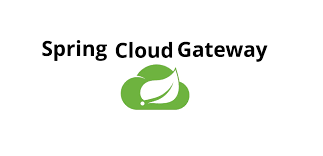

# API 게이트웨이의 실제 적용과 사례

### 목차
1. API 게이트웨이 솔루션
2. API 게이트웨이와 보안
3. 실제 사례 및 베스트 프랙티스
4. 전자정부 표준프레임워크 사례 살펴보기

## API 게이트웨이 솔루션
- Kong
    - 오픈소스 기반
    - Nginx + Cassandra + Lua Script 기반
    - 풍부한 플러그인 제공(custom plugin, kong-pongo를 활용한 단위/통합 테스트 가능)
    - 클라우드 네이티브: 플랫폼에 한정되지 않으며 모든 플랫폼에서 실행 및 모든 클라우드에서 기본적으로 실행 가능
- NGINX
    - 고성능 웹 서버, 비동기 이벤트 기반 아키텍처로 대규모 트래픽 처리에 적합
    - 로드 밸런싱을 통한 고가용성 및 성능 최적화
- AWS API Gateway
    - 검증된 다른 AWS 제공 서비스와 통합에 유리
    - 서버리스 아키텍처에 적합
    - 고비용 유의
- Spring Cloud Gateway
    - 스프링 생태계 프로젝트에 적합
    - 오픈 소스 기반 커스터마이징
    - 준수한 성능

## API 게이트웨이와 보안
### 인증/인가 처리 방식

- JWT(JSON Web Token)
    - 클라이언트에서 인증 성공 시 서버가 JWT 토큰을 발급하며, 이 토큰을 API 게이트웨이에 전달하여 요청 인증. API 게이트웨이에서 인증/인가 처리할 수 있음
- OAuth 2.0
    - 외부 애플리케이션이 사용자 정보를 안전하게 접근할 수 있도록 인증을 제공하는 프로토콜
    - API 게이트웨이와 연동하여 OAuth 2.0 인증 처리 가능

### DDoS 방어 및 속도 제한 적용 사례
- 속도 제한
    - API 게이트웨이는 각 클라이언트 별로 요청의 빈도를 제한할 수 있음
    - 이를 이용해 트래픽 및 DDoS와 같은 악의적 요청으로부터 보호

### 데이터 보안 및 암호화
- TLS/SSL을 사용한 데이터 전송 암호화
- HTTPS 프로토콜 사용을 통한 데이터 보호

## 실제 사례 및 베스트 프랙티스
### 기업 성공 사례
- Netflix
    - MSA로 전환하면서 Zuul API 게이트웨이를 도입
    - 로드밸런싱을 통해 수백 개 이상의 마이크로 서버를 효율적으로 관리
    - 동적 라우팅, 보안, 모니터링 구현
- Airbnb
    - Kong을 사용한 대규모 트래픽 처리
    - 플러그인 기능을 커스터마이징하여 다양한 보안 및 로깅 요구 사항 충족
- PayPal
    - API 게이트웨이를 통한 결제 시스템 보안 강화
    - 트랜잭션 모니터링 및 사기 탐지 기능 통합

### API 게이트웨이 도입 시 유의할 점과 피해야 할 실수
1. 과도한 중앙 집중화 피하기
    - 모든 로직을 게이트웨이에 집중시키지 않고, 마이크로 서비스의 자율성 유지
2. 병목 현상 주의
    - 적절한 캐싱 전략 수립
    - 효율적인 로드 밸런싱 구현
3. 단계적 도입 및 테스트
    - 소규모 파일럿 프로젝트로 시작
    - 충분한 부하 테스트 및 시나리오 검증


## 전자정부 표준프레임워크 사례 살펴보기
#### Spring Cloud Gateway 사용


### 구조
```
backend
├─apigateway
├─board-service
├─config
├─discovery
├─module-common
├─portal-service
├─reserve-check-service
├─reserve-item-service
├─reserve-request-service
└─user-service
```

### 설정
`build.gradle`
```
implementation 'org.springframework.cloud:spring-cloud-starter-gateway'
```

`application.yml`
```
server:
  port: 8000

spring:
  application:
    name: apigateway
  cloud:
    gateway:
      routes:
        - id: user-service
          uri: lb://USER-SERVICE
          predicates:
            - Path=/user-service/**
          filters:
            - RemoveRequestHeader=Cookie
            - RewritePath=/user-service/(?<segment>.*), /$\{segment}
        - id: portal-service
          uri: lb://PORTAL-SERVICE
          predicates:
            - Path=/portal-service/**
          filters:
            - RewritePath=/portal-service/(?<segment>.*), /$\{segment}
        - id: board-service
          uri: lb://BOARD-SERVICE
          predicates:
            - Path=/board-service/**
          filters:
            - RewritePath=/board-service/(?<segment>.*), /$\{segment}
        - id: reserve-item-service
          uri: lb://RESERVE-ITEM-SERVICE
          predicates:
            - Path=/reserve-item-service/**
          filters:
            - RewritePath=/reserve-item-service/(?<segment>.*), /$\{segment}
        - id: reserve-check-service
          uri: lb://RESERVE-CHECK-SERVICE
          predicates:
            - Path=/reserve-check-service/**
          filters:
            - RewritePath=/reserve-check-service/(?<segment>.*), /$\{segment}
        - id: reserve-request-service
          uri: lb://RESERVE-REQUEST-SERVICE
          predicates:
            - Path=/reserve-request-service/**
          filters:
            - RewritePath=/reserve-request-service/(?<segment>.*), /$\{segment}
        - id: openapi
          uri: http://localhost:${server.port}
          predicates:
            - Path=/v3/api-docs/**
          filters:
            - RewritePath=/v3/api-docs/(?<segment>.*), /$\{segment}/v3/api-docs
      default-filters:
        - name: GlobalFilter
          args:
            preLogger: true
            postLogger: true
      discovery:
        locator:
          enabled: true

# config server actuator
management:
  endpoints:
    web:
      exposure:
        include: refresh, health, beans, info

info:
  app:
    name: Spring Cloud Gateway
    description: API 라우팅 및 보안, 모니터링/메트릭 등의 기능을 간단하고 효과적인 방법으로 제공
  swagger-ui: http://localhost:8000/webjars/swagger-ui/index.html?configUrl=/v3/api-docs/swagger-config

messages:
  directory: ${user.dir}/msa-attach-volume/messages
```


### JWT 인증 방식을 활용한 보안

- user-service에서 jwt 토큰 발급


### 참고
- https://velog.io/@sh93/%EC%98%A4%ED%94%88%EC%86%8C%EC%8A%A4-Gateway-%EB%B9%84%EA%B5%90
- https://www.cloudflare.com/ko-kr/learning/security/api/what-is-an-api-gateway/
- https://github.com/msa-ez/airbnb_project
