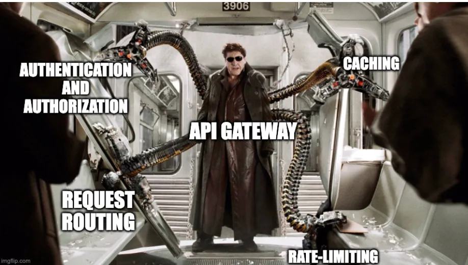
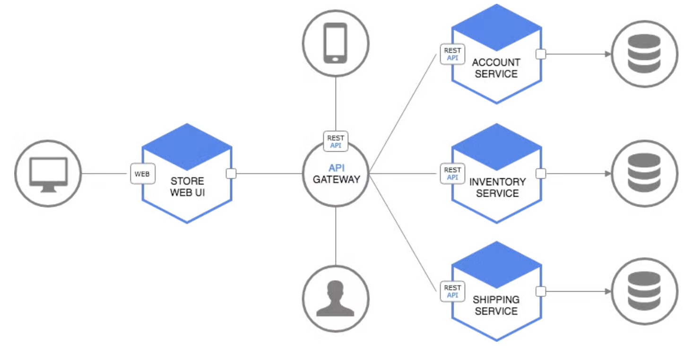
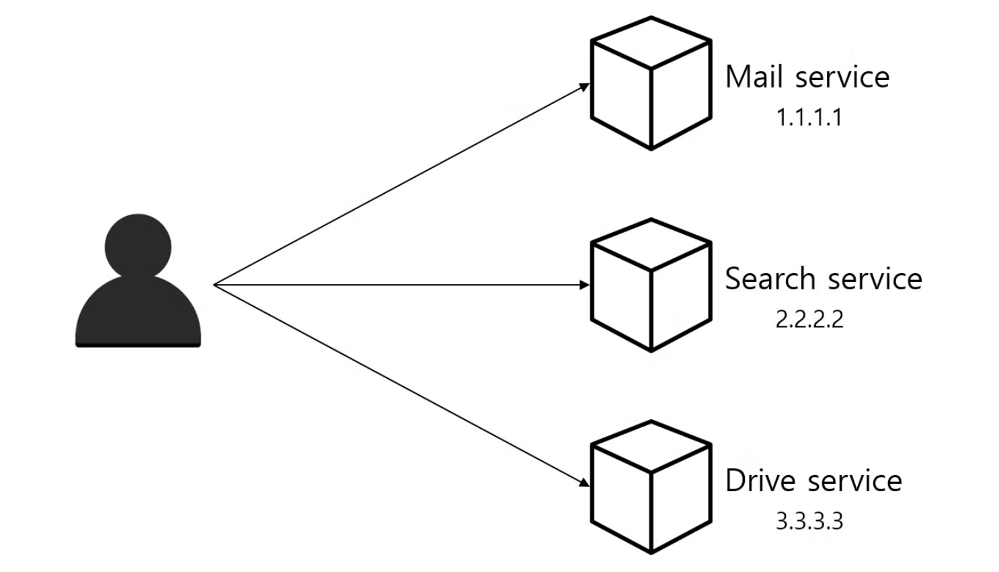

# API 게이트웨이

해당 글은 노션 기준으로 작성되었습니다.
 https://smoggy-client-47f.notion.site/API-10e5cbc9c488801bb93ed0af08eeca02?pvs=4

# 1. MicroService Architecture (MSA)

MicroService Architecture는 크게 Inner Architecture와 Outer Architecture로 구분할 수 있다.

MicroService Architecture는 크게 Inner Architecture와 Outer Architecture로 구분할 수 있다. 위 그림에서 남색 부분은 Inner Architecture의 영역이고, 회색 부분은 Outer Architecture 부분이다.

## 1.1. Inner Architecture

Inner Architecture는 내부 서비스를 어떻게 쪼개고 설계할지를 다루며, 마이크로서비스 정의, DB 접근 구조, API 설계 등이 포함된다. 서비스 정의는 비즈니스 특성과 서비스 간의 종속성을 고려해야 하며, 데이터베이스 정합성을 보장하는 방법도 필요하다. 각 비즈니스 및 시스템의 특성에 따라 표준화된 접근이 없기 때문에, MSA 설계에서 가장 어려운 부분이다.

## 1.2. Outer Architecture

Outer Architecture는 외부와의 연결 및 관리를 담당하는 부분이다.

### Outer Architecture (Gartner 분류)

Gartner에서는 MSA의 Outer architecture을 총 6개의 영역으로 분류하고 있다.

<aside>
💻

1. External Gateway
2. Service Mesh
3. Container Management
4. Backing Services
5. Telemetry
6. CI/CD Automation
</aside>

해당 글에서는 API Gateway와 관련된 External Gateway만 간단하게 설명한다.

### External Gateway와 API Gateway

External Gateway는 전체 서비스 외부로부터 들어오는 접근을 내부 구조를 드러내지 않고 처리하기 위한 요소이다. 사용자 인증(Consumer Identity Provider)과 권한 정책관리(policy management)를 수행하며 API Gateway가 여기서 가장 핵심적인 역할을 담당한다.

API Gateway는 서버 최앞단에 위치하여 모든 API 호출을 받는다. 받은 API 호출을 인증한 후, 적절한 서비스들에 메세지를 전달될 수 있도록 한다.(routing)

# 2. API Gateway

## 2.1. API Gateway의 필요성 (문제)

MSA는 큰 서비스를 잘게 쪼개어 개발/운영하는 아키텍처이다. 하나의 큰 서비스는 수십~수백 개의 작은 서비스로 나뉘어지며, 이를 클라이언트에서 직접 호출하는 형태라면 다음과 같은 문제점이 생길 수 있다

- **복잡성 증가 :**
    - 클라이언트는 여러 서비스에 대해 각각의 엔드포인트를 알아야 합니다.
    - 개별 요청마다 인증 및 권한 검증을 해야 한다.
    - 각 서비스마다 인증/인가 등 공통된 로직을 중복 구현해야 하는 번거로움이 있다.
- **보안 및 관리의 어려움**
    - 여러 서비스가 외부와 직접 통신할 경우, 보안 및 속도 제한 정책 등을 서비스별로 관리해야 한다.
    - 이는 관리 비용을 크게 증가시킨다.
    - 수많은 API 호출을 기록하고 관리하기가 어렵다.
    - 내부의 비즈니스 로직이 드러나게 되어 보안에 취약해진다.
- **성능 저하**
    - 클라이언트가 여러 서비스에 분산된 요청을 동시에 보내면 네트워크 트래픽이 분산되고, 부하가 발생해 성능에 영향을 미칠 수 있다.
    - 클라이언트에서 여러 마이크로서비스에 대한 번거로운 호출을 해야 한다.

특히 이러한 문제점들은 마이크로서비스의 개수가 많아질수록 기하급수적으로 늘어나게 됩니다. 이런 문제를 해결하기 위해 나온 것이 바로...

## 2.2. API Gateway의 정의 (해결)

API Gateway는 API 서버 앞단에서 모든 API 서버들의 엔드포인트를 단일화 해주는 또다른 서버이다. API에 대한 인증과 인가 기능을 가지고 있으며, 메세지의 내용에 따라 어플리케이션 내부에 있는 마이크로 서비스로 라우팅하는 역할을 담당한다.

> API Gateway의 시작은 SOA의 핵심 인프라라고 할 수 있는 ESB(Enterprise Service Bus)에서 시작되었다. 따라서 API Gateway의 많은 부분들이 ESB로 부터 승계되었는데!
>
>
> ESB가 SOAP/XML 기반의 무거운 기능을 가졌다면, API Gateway는 REST/JSON 기반으로 보다 가볍게 설계된 것이 특징이다.
>

## 2.3. API Gateway의 주요 기능 (해결)

### 1. 인증 및 인가 ( Authentication and Authorization)

<aside>
🔐

보안을 중앙 집중화하여 서비스 중복을 줄인다.

</aside>

마이크로 서비스 아키텍처에서 각각의 서비스에 API 호출에 대한 인증 및 인가를 하는 것은, 같은 소스코드를 서비스 인스턴스들마다 심어주어야한다는 것을 의미한다. 이러한 경우, 소스의 중복이 심하여 유지 관리가 어려운 것은 물론 로깅 및 모니터링을 관리하는 것도 매우 어려워진다.

이러한 이유로 인증서 관리나, 인증, SSL, 프로토콜 변환과 같은 기능들은 API Gateway에서 오프로드 함으로, 각각의 서비스의 부담을 줄이고, 서비스의 관리 및 업그레이드를 보다 쉽게 할 수 있게 한다.

> **Authentication(인증)과 Authorization(인가)의 차이**
>
>
> Authentication은 유저가 누구인지 확인하는 절차(A라고 하며 접근하는 사람이 진짜 A인지 확인하는 절차)이고, Authorization은 어떠한 유저가 특정 자원에 접근하려 할때, 그에대한 접근 권한이 있는지 확인하는 절차이다.
>

### 2. 요청 절차의 단순화

<aside>
📤

여러 서비스 호출을 단일 클라이언트 요청으로 통합하여 효율성을 높인다.

</aside>

여러 마이크로서비스를 대상으로하는 기능을 이용하려 할 때 만약 API Gateway가 없다면 클라이언트에서 여러 서비스들에 대해 요청을 진행해야 했을 것이다.

하지만 API Gateway는 여러 클라이언트의 요청을 단일 클라이언트의 요청으로 대체 가능하도록 한다. 따라서 클라이언트와 백엔드 간의 API 통신량을 줄여주어 대기시간을 줄이고 효율성을 높여줄 수 있다.

### 3. 라우팅 및 로드밸런싱

<aside>
🌏

요청을 적절한 서비스로 라우팅하고 트래픽을 고르게 분산한다.

</aside>

API Gateway는 클라이언트로 부터 접수된 메세지에 따라, API 호출을 적절한 서비스에 라우팅 할 수 있는 기능이 있다. 또한, 서비스 인스턴스들에 대한 부하분산을 할 수 있다.

### 4. 서비스 오케스트레이션

<aside>
⛓️

여러 서비스를 결합하여 단일 작업으로 수행한다.

</aside>

오케스트레이션은 여러개의 마이크로 서비스를 묶어 새로운 서비스를 만드는 개념! 오케스트레이션 로직을 과도하게 넣는 것은, API Gateway의 부담을 늘리는 것으로, 성능 저하를 일으킬 수 있어, MSA와 API Gateway에 대한 높은 수준의 기술적 이해를 바탕으로 이루어져야 한다.

### 5. 서비스 디스커버리

<aside>
☁️

클라우드 환경에서 동적으로 서비스 위치를 찾는다.

</aside>

API Gateway는 각 서비스를 호출하기위해, 서비스마다의 IP주소와 포트번호를 알고 있어야 한다. legacy 환경에서는 고정적인 IP주소를 가지고 있기 때문에 크게 문제될 것이 없지만, 클라우드 환경에서는 동적인 환경에서 배포되기 때문에 서비스의 위치를 찾는 것이 어렵다. 이러한 서비스의 위치(IP 주소와 포트번호)를 찾는 것을 **Service Discovery**라 하며, API Gateway에서는 서버사이드나, 클라이언트 사이드를 기준으로 하여 서비스 디스커버리를 구현할 수 있다.

## 2.4. API Gateway 아키텍처

API 게이트웨이의 기본 아키텍처는 클라이언트와 백엔드 서비스 간의 중개자 역할을 한다. 주요 구성 요소는 다음과 같다.

- **Request Handling**: API 게이트웨이는 클라이언트로부터 받은 요청을 분석하고, 서비스별로 정의된 정책에 따라 요청을 처리한다.
- **Policy Enforcement**: API 게이트웨이는 인증, 권한 부여, 속도 제한, 로드 밸런싱 등 정책을 강제한다.
- **Routing**: 게이트웨이는 요청을 적절한 백엔드 서비스로 라우팅하며, 경우에 따라서는 여러 서비스의 응답을 통합하여 클라이언트에 전달할 수 있다.

## 2.5. API Gateway의 **장단점**

**장점**

- **보안 강화**: 모든 요청이 API 게이트웨이를 통해 처리되므로, 중앙 집중식 인증 및 보안 정책을 설정할 수 있다.
- **성능 최적화**: 속도 제한과 로드 밸런싱을 통해 백엔드 서비스의 부하를 관리할 수 있다. 또한 캐싱 기능을 통해 성능을 더욱 향상시킬 수 있다.
- **중앙 관리**: 각 마이크로서비스별로 인증 및 권한 부여, 보안 정책을 개별적으로 관리하지 않아도 된다.
- **유연성**: 다양한 클라이언트 디바이스 (웹, 모바일 등)에 맞춰 요청 형식을 변환할 수 있다.

**단점**

- **단일 장애점**: API 게이트웨이에 문제가 발생하면 전체 시스템이 영향을 받을 수 있으므로 고가용성 설계가 필요하다.
- **추가 지연**: 클라이언트와 백엔드 간의 요청이 게이트웨이를 거치면서 약간의 지연이 발생할 수 있다.
- **복잡성 증가**: API 게이트웨이를 설계하고 유지보수하는 데 있어 추가적인 복잡성이 발생할 수 있다.

## 2.6. 다른 기술과의 관계

### **2.6.1 서비스 메시(Service Mesh)**

API 게이트웨이는 **서비스 메시(Service Mesh)** 와 상호보완적인 관계를 가진다. 서비스 메시가 마이크로서비스 간의 통신을 관리하는 반면, API 게이트웨이는 외부 클라이언트와 서비스 간의 통신을 처리한다.

### **2.6.2 리버스 프록시**

API 게이트웨이는 **리버스 프록시**와 유사하지만, 더 많은 고급 기능(정책 적용, 인증, 속도 제한 등)을 제공하여 보다 확장된 역할을 수행한다.

## 2.7. API Gateway 적용시 고려해야 할 사항

1. **내부 결합 문제**: API Gateway가 마이크로서비스와 결합되면서, 과거 SOA의 ESB 문제(오버헤드, 과도한 오케스트레이션) 재발 가능성이 있다.
2. **스케일 아웃 유연성**: API Gateway의 확장이 유연하지 않으면 성능 저하의 병목 현상이 발생할 수 있다.
3. **네트워크 지연 증가**: 추가적인 계층으로 인해 네트워크 지연(latency)이 증가할 수 있다.

# 3. 서비스 호출 패턴 비교

마이크로서비스 아키텍처에서 각 마이크로서비스는 일반적으로 엔드포인트를 이용해 서비스 호출을 지원한다.

마이크로서비스에서 서비스 호출 패턴에는 세 가지가 있다.

<aside>
☁️

1. LoadBalancer To Microservice 방식
2. API Gateway to Microservice 방식
3. API Gateway + BFF(Backend For Frontend) 방식
</aside>

### **3.1. LoadBalancer To Microservice 패턴 (Not Using API Gateway)**

마이크로서비스 아키텍처에서는 각 서비스가 별도의 엔드포인트를 가지며, 로드밸런서가 클라이언트의 요청을 여러 서비스로 분산한다. 그러나 대규모 어플리케이션에서는 다음과 같은 이슈가 발생할 수 있다.

- UI와 마이크로서비스 간의 네트워크 트래픽 증가로 대기 시간과 처리 복잡성이 증가
- 보안 및 권한 부여를 위한 상당한 개발 노력 필요
- 클라이언트 레벨에서 지원되지 않는 서버 프로토콜 문제
- 이기종 클라이언트에 적합하지 않은 API 디자인

### **3.2. API Gateway 패턴**

마이크로서비스 아키텍처에서 API Gateway를 사용하면 클라이언트가 여러 서비스와 효율적으로 상호작용할 수 있다. API Gateway가 없으면 클라이언트가 직접 로드밸런서에 요청을 보내야 하며, 이로 인해 클라이언트 앱이 내부 마이크로서비스에 강하게 결합되고, 여러 번의 네트워크 왕복으로 대기 시간이 증가하며, 보안 문제와 권한 부여 처리의 복잡성이 증가한다. API Gateway는 단일 진입점을 제공하고, 인증 및 캐시 같은 기능을 지원하여 이러한 문제를 해결한다.

### **3.3. API Gateway + BFF 패턴**

API Gateway는 클라이언트 앱의 다양한 요구 사항에 따라 API가 증가할 수 있으며, 단일 API Gateway가 모든 내부 마이크로서비스를 호출하면 기존의 모놀리식 아키텍처와 유사해질 위험이 있다. 이를 방지하기 위해, 클라이언트 앱별로 API Gateway를 분할하는 것이 좋다.

여러 개의 API Gateway를 사용하면 다양한 클라이언트 앱이나 비즈니스 로직에 따라 다른 응답을 처리할 수 있으며, 이를 BFF(Backend For Frontend) 패턴이라고 한다.

## 참고자료

- https://www.msaschool.io/operation/architecture/architecture-one/
- https://bcho.tistory.com/1005
- https://velog.io/@combi_jihoon/aws-서비스-정리-API-Gateway
