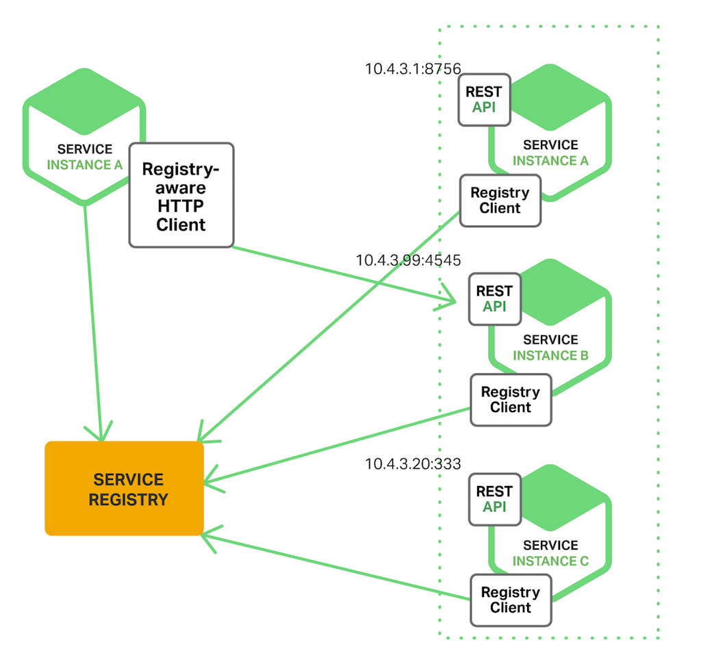

# 쿠버네티스
- [1. 쿠버네티스란? (Kubernetes)](#1-쿠버네티스란-kubernetes)
- [2. 등장 배경](#2-등장-배경)
    - [문제](#문제)
    - [해결책](#해결책)
- [3. 쿠버네티스 아키텍처](#3-쿠버네티스-아키텍처)
    - [Control Plane Components (Master Node)](#control-plane-components-master-node)
    - [Node Components (Worker Node)](#node-components-worker-node)
- [4. 컨테이너 오케스트레이션 툴 비교](#4-컨테이너-오케스트레이션-툴-비교)
- [5. 코드 분석](#5-코드-분석)
    - [분석할 레포지토리 소개: `egovframe-msa-edu`](#분석할-레포지토리-소개-egovframe-msa-edu)
    - [Kubernetes 환경 구성 분석](#kubernetes-환경-구성-분석)
    - [Ingress의 역할](#ingress의-역할)
    - [Kustomize로 구성 관리하기](#kustomize로-구성-관리하기)
    - [`kustomize.yaml` 파일 구조 분석](#kustomizeyaml-파일-구조-분석)
    - [Kubernetes 구성 관리 도구 비교](#kubernetes-구성-관리-도구-비교)
    - [Frontend와 Backend 서비스 구성](#frontend와-backend-서비스-구성)
    - [Frontend 구성 요소](#frontend-구성-요소)
    - [Backend 구성 요소](#backend-구성-요소)
    - [Environments 구성 요소](#environments-구성-요소)
    - [Databases](#databases)
    - [Logging: ELK 스택](#logging-elk-스택)
    - [RabbitMQ](#rabbitmq)
    - [Zipkin](#zipkin)
    - [Storage 구성 요소](#storage-구성-요소)
    - [NFS (Network File System)](#nfs-network-file-system)
    - [Vagrant 환경 설정](#vagrant-환경-설정)
    - [OpenStack Cinder](#openstack-cinder)
    - [왜 NFS와 OpenStack Cinder를 함께 사용하는가?](#왜-nfs와-openstack-cinder를-함께-사용하는가)

# 1. 쿠버네티스란? (Kubernetes)

> **분산형 애플리케이션 및 서비스 규모에 맞게 실행하도록 설계된 오픈소스 컨테이너 오케스트레이션 플랫폼**


# 2. 등장 배경

### 문제

> Traditional Deployment(전통적인 배포 시대)
> → Virtualized Deployment(가상화된 배포 시대)
> → Container Deployment(컨테이너 개발 시대)


물리 서버에서 리소스 할당 문제를 해결하고자 가상화 기술이 등장하였습니다. 하나의 물리 서버에 여러 가상 시스템(VM)을 실행할 수 있게 되었지만, 가상화 기술은 무겁고 느리다는 단점이 있었습니다. 운영체제를 공유하며 애플리케이션을 격리하는 컨테이너 기술이 등장하며 이러한 단점을 해결하였습니다.

도커가 컨테이너 기반의 서버 환경이 많아지면서 컨테이너 관리에 어려움을 겪게 되었습니다. 프로덕션 환경에서 여러 대의 서버에 동작중인 컨테이너가 정상적으로 동작하는지, 다운되었을 때 어떻게 대처할지 등을 시스템에 의해 처리하기 위해 컨테이너 오케스트레이션 시스템이 필요해졌습니다.

### 해결책

이를 해결하고자 쿠버네티스가 등장하게 됩니다. 수동으로 제어하던 컨테이너의 배포, 운영을 자동화하는 오케스트레이션 시스템으로, 여러 서버들을 클러스터로 구성하여 손쉽게 관리할 수 있게 되었습니다.

쿠버네티스의 기능은 다음과 같습니다.

- 서비스 디스커버리와 로드 밸런싱
- 스토리지 오케스트레이션
- 자동화된 롤아웃과 롤백
- 자동화된 빈 패킹(bin packing)
- **자동화된 복구(self-healing)**
- 시크릿과 구성 관리

# 3. 쿠버네티스 아키텍처

> 쿠버네티스 클러스터는 컴퓨터 집합인 `Node Components`와 `Control Plane Components`로 구성됩니다.


### Control Plane Components (Master Node)

> 클러스터에 관한 전반적인 결정을 수행하고 클러스터 이벤트를 감지하고 반응합니다.

- `kube-apiserver` : 쿠버네티스 API 서버이자 쿠버네티스 control plane의 프론트엔드
- `etcd` : 모든 클러스터 데이터를 저장하는 저장소. key-value 형태로 데이터를 저장
- `kube-scheduler` : 새로 생성된 파드를 감지하고 실행할 노드 선택
- `kube-controller-manager` : 컨트롤러 프로세스를 실행
- `cloud-controller-manager` : 클라우드 공급자의 API와 통신

### Node Components (Worker Node)

> 동작 중인 파드를 유지시키고 쿠버네티스 런타임 환경을 제공하며, 모든 노드 상에서 동작합니다.

- `kubelet` : 클러스터 각 노드에서 실행되는 에이전트. 파드에서 컨테이너가 실행되도록 관리
- `kube-proxy` :클러스터 각 노드에서 실행되는 네트워크 프록시.
- `Container Runtime` : 컨테이너 실행을 담당하는 소프트웨어. Docker, containerd 등

# 4. 컨테이너 오케스트레이션 툴 비교

| 특징          | Kubernetes       | Docker Swarm | Apache Mesos | Nomad  | Rancher | OpenShift |
| ------------- | ---------------- | ------------ | ------------ | ------ | ------- | --------- |
| 복잡성        | 높음             | 낮음         | 중간         | 낮음   | 중간    | 높음      |
| 확장성        | 매우 높음        | 중간         | 매우 높음    | 높음   | 높음    | 매우 높음 |
| 학습 곡선     | 가파름           | 완만함       | 가파름       | 중간   | 중간    | 가파름    |
| 커뮤니티 지원 | 매우 강함        | 강함         | 중간         | 중간   | 강함    | 강함      |
| 기업용 기능   | 있음             | 제한적       | 있음         | 제한적 | 있음    | 매우 강함 |
| 클라우드 지원 | 뛰어남           | 좋음         | 좋음         | 좋음   | 뛰어남  | 뛰어남    |
| 설치 난이도   | 복잡함           | 간단함       | 복잡함       | 간단함 | 중간    | 복잡함    |
| 모니터링 도구 | 내장 + 확장 가능 | 기본         | 확장 가능    | 기본   | 강력함  | 강력함    |
| 자동 스케일링 | 내장             | 제한적       | 지원         | 지원   | 지원    | 지원      |
| 롤링 업데이트 | 지원             | 지원         | 지원         | 지원   | 지원    | 지원      |

# 5. 코드 분석

### 분석할 레포지토리 소개: `egovframe-msa-edu`

오늘 분석할 레포지토리는 [eGovFramework organization의 egovframe-msa-edu](https://github.com/eGovFramework/egovframe-msa-edu)입니다. 이 프로젝트는 클라우드 네이티브 기반의 행정 및 공공기관 서비스 확산을 지원하기 위해 설계되었으며, 다양한 MSA(Microservices Architecture) 교육 자료를 제공합니다.

### Kubernetes 환경 구성 분석

먼저, 레포지토리의 `k8s` 폴더 구조를 살펴보겠습니다. `k8s` 폴더는 크게 세 가지 디렉터리로 나뉩니다: `applications`, `environments`, `storage`. 이 구조는 각 서비스와 환경 설정, 그리고 스토리지 관리를 별도로 모듈화하여 관리하고 있습니다.

```
└─k8s
├─applications
│  ├─backend
│  │  ├─apigateway
│  │  │  └─ingress
│  │  ├─board-service
│  │  ├─config
│  │  ├─discovery
│  │  │  └─ingress
│  │  ├─portal-service
│  │  ├─reserve-check-service
│  │  ├─reserve-item-service
│  │  ├─reserve-request-service
│  │  └─user-service
│  └─frontend
│      ├─admin
│      │  └─ingress
│      └─portal
│          └─ingress
├─environments
│  ├─configmaps
│  ├─databases
│  │  └─mysql
│  │      └─init
│  ├─jenkins
│  ├─logging
│  │  └─elk
│  │      ├─elasticsearch
│  │      ├─kibana
│  │      │  └─ingress
│  │      └─logstash
│  ├─nfs
│  ├─rabbitmq
│  │  └─ingress
│  ├─vagrant
│  └─zipkin
│      └─ingress
└─storage
```

이를 아키텍처로 간단하게 나타내보면 다음과 같습니다.


### Ingress의 역할


Kubernetes 클러스터 외부에서 내부 서비스로 HTTP와 HTTPS 경로를 노출할 때, `Ingress` 리소스를 사용합니다. 이 리소스는 외부 요청을 클러스터 내부의 적절한 서비스로 라우팅하는 역할을 하며, 복잡한 네트워크 설정 없이도 외부 접근을 쉽게 관리할 수 있습니다. 예를 들어, 호텔의 프론트 데스크처럼 모든 외부 요청을 적절한 내부 서비스로 안내하는 것과 비슷한 역할을 합니다.

참고: [Ingress 공식 문서](https://kubernetes.io/ko/docs/concepts/services-networking/ingress/)

### Kustomize로 구성 관리하기

eGovFramework 레포지토리에서 눈에 띄는 또 다른 구성 요소는 `kustomize`입니다. `kustomize`는 Kubernetes 매니페스트 파일을 사용자 정의하고 관리하기 위한 도구로, 다양한 환경에 대한 구성 관리가 용이합니다.

### `kustomize.yaml` 파일 구조 분석


각각의 `kustomization.yaml` 파일은 애플리케이션의 다양한 계층 또는 구성 요소를 관리합니다. 아래는 `applications` 디렉터리의 예시입니다:

1. `applications/kustomization.yaml`
   - 역할: 전체 애플리케이션의 최상위 구성을 정의하며, 프론트엔드와 백엔드 구성을 하나로 묶어 전체 구조를 정의합니다.
2. `applications/backend/kustomization.yaml`
   - 역할: 백엔드 서비스의 세부 구성을 정의하고, 사용될 Docker 이미지와 인그레스 설정 등을 관리합니다.
3. `applications/frontend/kustomization.yaml`
   - 역할: 프론트엔드 애플리케이션의 구성을 정의하며, 프론트엔드 Docker 이미지와 인그레스 설정 등을 관리합니다.

이러한 구조는 마이크로서비스 아키텍처에서 구성 요소를 모듈화하고 관리하기 쉽게 만듭니다.

### Kubernetes 구성 관리 도구 비교

Kubernetes 환경에서 구성 관리 도구를 선택하는 것은 매우 중요합니다. `Kustomize` 외에도 다양한 도구가 존재하며, 프로젝트 요구사항에 따라 적절한 도구를 선택해야 합니다. 아래는 대표적인 도구들의 특징을 정리한 표입니다.

| 특징            | Kustomize            | Helm               | Jsonnet            | Ansible             |
| --------------- | -------------------- | ------------------ | ------------------ | ------------------- |
| 유형            | 네이티브 K8s 도구    | 패키지 관리자      | 데이터 템플릿 언어 | 자동화 도구         |
| 설정 방식       | YAML                 | YAML + Go 템플릿   | Jsonnet            | YAML                |
| 학습 곡선       | 낮음                 | 중간               | 높음               | 중간                |
| 템플릿 사용     | 아니오 (순수 YAML)   | 예                 | 예                 | 제한적              |
| 패키징 & 배포   | 제한적               | 강력함             | 제한적             | 강력함              |
| 버전 관리       | Git 통합             | 차트 버전 관리     | Git 통합           | Git 통합            |
| 플러그인 생태계 | 제한적               | 풍부함             | 제한적             | 매우 풍부함         |
| 환경별 구성     | 오버레이로 쉬움      | values.yaml로 관리 | 환경별 파일 필요   | 인벤토리로 관리     |
| 복잡성 관리     | 모듈화로 관리        | 차트와 서브차트    | 함수와 라이브러리  | 역할과 플레이북     |
| 주요 장점       | 간단함, K8s 네이티브 | 강력한 패키징      | 유연한 템플릿      | 광범위한 자동화     |
| 주요 단점       | 고급 기능 제한적     | 복잡한 템플릿      | 학습 곡선 높음     | K8s에 특화되지 않음 |

각 도구는 고유한 강점이 있으며, 프로젝트 요구사항과 팀 역량에 따라 적절한 도구를 선택해야 합니다.

### Frontend와 Backend 서비스 구성

### Frontend 구성 요소

```
frontend/admin
│
├── ingress/
│   └── ingress.yaml
│
├── autoscaler.yaml
│
├── deployment.yaml
│
└── service.yaml

frontend/portal
│
├── ingress/
│   └── ingress.yaml
│
├── autoscaler.yaml
│
├── deployment.yaml
│
└── service.yaml
```

`frontend/admin`과 `frontend/portal` 디렉터리에는 인그레스, 오토스케일러, 배포 및 서비스 설정이 포함된 여러 YAML 파일이 있습니다.

- **Ingress**: 외부 트래픽을 프론트엔드 애플리케이션으로 라우팅하며, 관리자 UI 접근을 관리합니다.
- **HorizontalPodAutoscaler**: 트래픽 증가에 따라 Pod 수를 자동으로 조절하여 성능을 유지합니다.
- **Deployment**: 실제 프론트엔드 애플리케이션을 실행하고 관리합니다.
- **Service**: 네트워크 접근을 관리하며, 외부 및 클러스터 내부 접근을 제공합니다.

### Backend 구성 요소

```
backend/
├── apigateway/
│   └── ingress/
├── board-service/
├── config/
├── discovery/
│   └── ingress/
├── portal-service/
├── reserve-check-service/
├── reserve-item-service/
├── reserve-request-service/
└── user-service/
```

`backend` 디렉터리는 다양한 마이크로서비스로 구성되어 있으며, `apigateway`와 `discovery` 서비스가 핵심적인 역할을 합니다.

- **API Gateway**: 모든 API 서버들의 엔드포인트를 단일화하고, 인증 및 인가를 관리합니다.


- **Discovery**: 분산 환경에서 동적으로 변경되는 서비스의 위치를 관리하며, 클라이언트가 서비스를 호출할 때 필요한 정보를 제공합니다.



### Environments 구성 요소

`environments` 디렉터리는 Kubernetes 클러스터의 다양한 환경 설정을 포함하고 있습니다. 여기에는 데이터베이스 설정, 로깅 및 모니터링 시스템, 메시지 브로커 설정 등이 포함되어 있습니다. 각 환경 구성 요소를 살펴보겠습니다.

### Databases

이 섹션에서는 MySQL 데이터베이스의 Kubernetes 리소스가 정의되어 있습니다. 주요 구성 요소는 다음과 같습니다:

- **PersistentVolumeClaim**: MySQL 데이터를 위한 5Gi NFS 스토리지를 요청합니다.
- **Secret**: MySQL 데이터베이스의 비밀번호를 안전하게 저장하기 위해 사용되며, `base64`로 인코딩된 'msaportal' 비밀번호를 포함합니다.
- **Service**: MySQL 포드에 대한 3306 포트 접근을 제공합니다.
- **ConfigMap**: MySQL 사용자, 데이터베이스 이름, 타임존 등의 구성 정보를 저장합니다.
- **StatefulSet**: Kubernetes StatefulSet을 사용하여 MySQL 데이터베이스를 배포하며, 데이터를 영구적으로 저장하기 위해 PersistentVolumeClaim을 사용합니다.

이러한 구성을 통해 안정적이고 확장 가능한 데이터베이스 환경을 제공하며, 마이크로서비스 아키텍처의 중요한 데이터 저장소 역할을 수행합니다.

### RabbitMQ

메시지 브로커인 RabbitMQ는 마이크로서비스 간의 비동기 통신을 담당합니다. Ingress 설정을 통해 외부 접근을 관리하고, 안정적인 메시징 환경을 제공합니다.

### Zipkin

Zipkin은 분산 추적 시스템으로, 마이크로서비스 간의 호출 관계를 추적하고 분석하는 데 사용됩니다. 이를 통해 서비스 호출 시 지연 발생 원인을 파악하고, 성능 최적화에 기여할 수 있습니다.

### Storage 구성 요소

`storage` 디렉터리에는 다양한 스토리지 옵션이 포함되어 있습니다. 여기에는 NFS와 Cinder와 같은 스토리지 클래스가 있으며, 다양한 환경에서 사용할 수 있도록 유연하게 구성되어 있습니다.

### NFS (Network File System)

NFS는 여러 노드에서 동시에 접근 가능한 공유 스토리지를 제공합니다.

- **NFS Provisioner Deployment**: NFS 프로비저너를 배포하여, 동적으로 PV를 생성할 수 있는 환경을 제공합니다.
- **RBAC 설정**: NFS 프로비저너에 필요한 권한을 부여하여 PV 생성 및 관리를 가능하게 합니다.
- **StorageClass 정의**: 'nfs'라는 이름의 StorageClass를 생성하여, PVC가 동적으로 NFS 기반의 PV를 요청할 수 있도록 설정합니다.

이 구성은 Kubernetes 클러스터에서 NFS 스토리지를 동적으로 프로비저닝할 수 있는 환경을 제공하며, 안전하고 효율적인 스토리지 관리가 가능합니다.

### Logging: ELK 스택

로깅 시스템은 `ELK (Elasticsearch, Logstash, Kibana)` 스택으로 구성되어 있습니다.

- **Elasticsearch**: 로그 데이터를 저장하고 검색할 수 있는 강력한 검색 및 분석 엔진입니다.
- **Logstash**: 로그를 수집하고 Elasticsearch로 전달하기 전에 필터링하고 변환합니다.
- **Kibana**: Elasticsearch에 저장된 로그 데이터를 시각화하고 분석할 수 있는 도구입니다.

이 구성은 마이크로서비스 아키텍처에서 로그 데이터를 효율적으로 수집하고 분석할 수 있게 해주며, 문제 발생 시 빠르게 원인을 파악할 수 있는 환경을 제공합니다.


### Vagrant 환경 설정

Vagrant를 사용하여 Kubernetes 클러스터를 손쉽게 구성할 수 있는 개발 및 테스트 환경을 제공합니다.

- **클러스터 구성**: 1개의 control-plane과 2개의 worker 노드로 구성되며, 각 노드는 Ubuntu 20.04 이미지를 사용합니다.
- **네트워크 설정**: 프라이빗 네트워크를 사용하여 노드 간 통신을 관리하며, 포트 포워딩을 통해 외부 접근을 지원합니다.
- **특징**: VirtualBox 프로바이더를 사용하여 Ceph와 같은 분산 스토리지 시스템을 실험하기에 적합한 환경을 제공합니다.

### OpenStack Cinder

NFS 스토리지 외에도 `egovframe-msa-edu` 레포지토리에서는 OpenStack 기반의 Cinder 스토리지도 사용됩니다. 이는 다양한 환경 요구 사항과 스토리지 사용 시나리오에 대응하기 위해서입니다.

- **PersistentVolumeClaim (Cinder PVC)**: Cinder 스토리지는 단일 노드에서만 접근 가능한 블록 스토리지를 제공합니다. ReadWriteOnce 접근 모드로 5Gi의 스토리지를 요청하는 구성을 사용합니다.
- **StorageClass**: 'cinder'라는 이름의 StorageClass를 정의하여, Kubernetes 클러스터 내에서 Cinder 기반의 스토리지를 사용할 수 있게 합니다.

### 왜 NFS와 OpenStack Cinder를 함께 사용하는가?

NFS와 OpenStack Cinder를 함께 사용하는 이유는 각 스토리지의 장점을 활용하여 다양한 요구사항을 충족하기 위해서입니다.

- **NFS의 장점**:
  - **다중 접근**: 여러 노드에서 동시에 접근할 수 있는 공유 스토리지를 제공하여, 분산 파일 시스템처럼 동작합니다.
  - **유연성**: 다양한 애플리케이션에서 공통적으로 사용되는 데이터를 저장할 수 있어, 공유 자원 관리에 용이합니다.
- **Cinder의 장점**:
  - **블록 스토리지**: 데이터베이스와 같은 단일 애플리케이션에 특화된 스토리지 요구사항을 충족합니다. 높은 I/O 성능을 요구하는 애플리케이션에 적합합니다.
  - **데이터 보안**: 단일 노드에서만 접근 가능하도록 설정되어 있어, 특정 애플리케이션의 데이터 보안 요구 사항을 만족시킵니다.

이러한 구성을 통해, eGovFramework는 애플리케이션의 데이터 접근 패턴에 따라 적절한 스토리지 옵션을 선택할 수 있는 유연성을 제공합니다. 예를 들어, 여러 애플리케이션이 공통 데이터를 공유해야 하는 경우 NFS를 사용하고, 데이터베이스와 같이 고성능 I/O가 필요한 애플리케이션은 Cinder를 사용하는 방식입니다.
