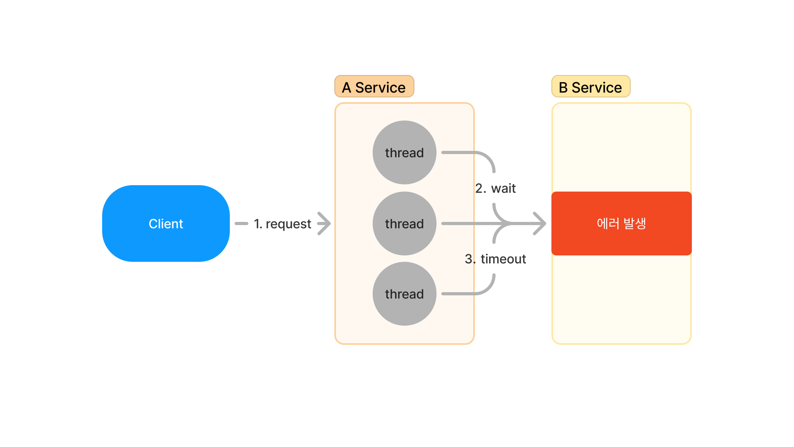
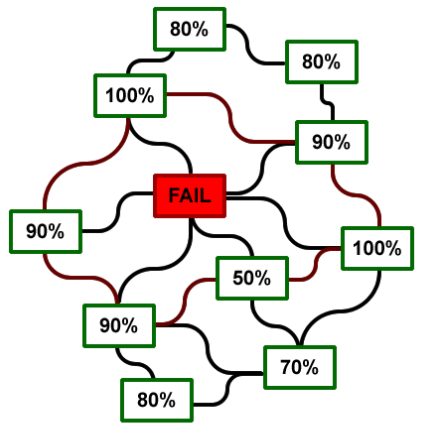
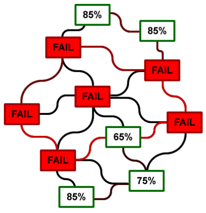
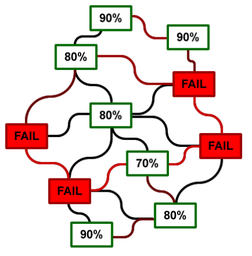
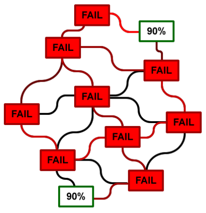
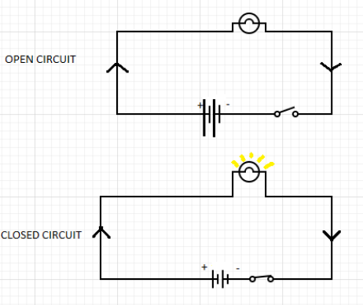
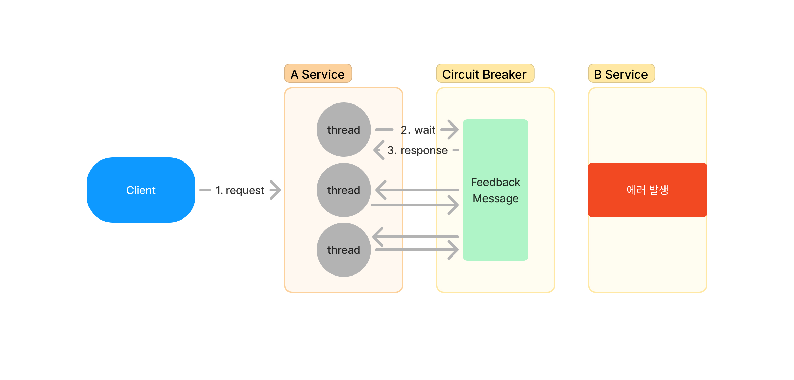
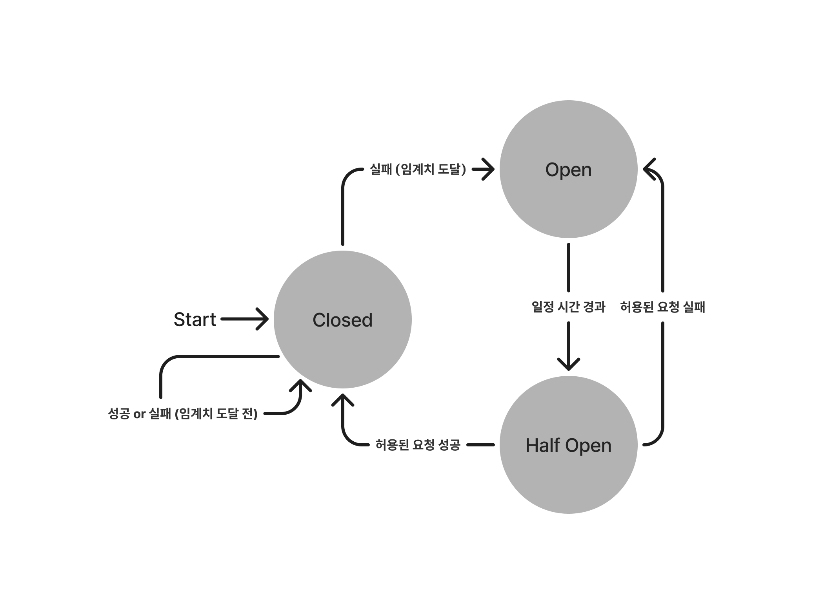

# 서킷 브레이커(Circuit Breaker)

## 문제 상황

마이크로서비스 아키텍처(MSA)와 같은 분산 환경에서는 외부 서비스를 호출하는 경우가 많습니다. 이러한 외부 서비스는 내부 시스템과는 독립적으로 동작하기 때문에 문제가 발생하면 장애의 원인을 추적하기 어려워집니다. 또한, 외부 서비스가 실패했을 때 그것이 내부 시스템에서 처리하기도 어려워집니다.

한가지 예를 들어보겠습니다.

1. MSA를 단순화하여 A 서비스와 B 서비스가 있다.
2. A 서비스는 특정 작업을 처리하기 위해 B 서비스를 호출한다.
3. 그러나 B 서비스는 장애가 발생하여 정상작동을 못하는 상태이다.

이때 클라이언트의 요청을 받은 A 서비스는 B 서비스로부터 2가지 응답을 받을 수 있습니다.

1. 에러 상태 응답: B 서비스가 오류를 감지하고 즉시 A 서비스에 에러 상태를 반환하는 경우
2. 타임아웃: B 서비스가 응답하지 않고, A 서비스가 설정한 타임리미트까지 대기하는 경우.

에러 상태 응답을 받는 경우, A 서비스는 즉시 에러를 처리하고 다음 작업으로 넘어갈 수 있습니다. 그러나 타임아웃이 발생하면, A 서비스는 타임아웃 시간이 끝날 때까지 대기해야 하므로 그 시간 동안 스레드가 점유됩니다. 만약 동시에 여러 요청이 들어오고, 여러 스레드가 점유되면 스레드 고갈로 이어질 수 있습니다. 모든 스레드가 점유되면 클라이언트 요청을 처리할 수 없는 상태에 도달하게 됩니다.

### 장애 전파

이 문제는 여러 서비스가 연결된 환경에서는 더 치명적일 수 있습니다. 한 서비스의 장애가 다른 서비스로 전파되면서 전체 시스템에 영향을 미칠 수 있습니다. 이를 **Cascading Failure**라고 합니다.

Cascading failure는 다음과 같은 방식으로 발생합니다.

1. 하나의 서비스에서 장애가 발생합니다.  
   
2. 이 장애는 다른 서비스까지 전파됩니다. 
   
3. 처음 장애가 발생한 서비스가 복구되더라도, 이미 장애를 받은 다른 서비스들이 여전히 문제를 겪고 있을 수 있습니다. 
   
4. 다른 서비스들의 전파된 장애로 또다시 장애가 생기게 됩니다. 
   

결과적으로, 네트워크의 한 부분에서 발생한 문제가 다른 부분으로 점진적으로 확산되어 시스템 전체가 불안정해지고, 장애의 원인을 파악하는 것이 점점 어려워집니다.

## 해결 방법

이런 상황을 해결하기 위한 방법으로 서킷 브레이커 패턴을 사용할 수 있습니다.

서킷 브레이커는 원래 전기 회로에서 사용하는 장치로, 전기회로에 누전 등 문제가 생겼을 때 작동하여 자동으로 회로를 차단해 회로를 정지시키고 더 큰 피해를 막는 역할을 합니다.

이 전기회로에서는 스위치가 눌리지 않아 연결되지 않는 것을 **개방 회로(open circuit)**, 스위치가 눌려 연결된 상태를 **폐쇄 회로(closed circuit)** 라고 말합니다.

이 전기회로에서 아이디어를 가져와서 서킷브래이커는 외부 서비스의 상태를 모니터링하고, 장애가 감지되면 자동으로 연결을 차단합니다. 이를 통해 외부 시스템으로 더 이상 불필요한 요청을 보내지 않으며 장애의 전파를 막을 수 있습니다. 또한, 문제가 생긴 외부시스템으로의 요청이 발생했을 때 서킷 브레이커는 준비된 피드백 메시지를 전달하여 장애에 대한 정보를 얻을 수 있습니다.

### 서킷 브레이커 작동 방식

서킷 브레이커는 3가지 상태를 가지고 상황을 판단합니다. (상태 이름은 전기회로에서 가져왔다)

1. **Closed**: 실패율이 임계치 이하일 때는 요청을 그대로 전달합니다. 이 상태에서는 장애가 없는 것으로 판단되며 정상적으로 외부 서비스와 통신이 이루어집니다.
2. **Open**: 실패율이 임계치를 초과하면 요청을 차단하고 즉시 실패 처리를 합니다. 이 상태에서는 더 이상 외부 서비스로의 요청이 이루어지지 않으며, 내부 시스템의 자원을 보호합니다.
3. **Half Open**: Open 상태가 된 후 일정 시간이 지나면 일부 요청을 다시 허용하여 외부 서비스의 상태를 점검합니다. 요청이 성공하면 Closed 상태로 복귀하고, 실패하면 다시 Open 상태로 전환됩니다.

### 상태 다이어그램

### 서킷 브레이커 요청 실패 판단 기준

서킷 브레이커는 다음 두 가지 기준으로 실패 여부를 판단합니다:

1. Slow Call: 요청이 예상 시간보다 오래 걸리는 경우.
2. Failure Call: 요청이 실패하거나 오류 응답을 받은 경우.

## 서킷 브레이커 장점

1. 장애 감지 및 격리
   서킷 브레이커는 장애가 발생한 서비스를 감지하고 해당 서비스를 격리시켜 자원이 낭비되는 것을 방지합니다. 이렇게 함으로써 시스템 전체가 장애로 인해 중단되는 것을 방지할 수 있습니다.

2. 자동 시스템 복구
   Half Open 상태를 통해 시스템이 복구되었는지 여부를 지속적으로 모니터링하며, 서비스가 정상 상태로 복구되면 자동으로 연결을 다시 활성화합니다. 이를 통해 장애 복구 후에도 별도의 개입 없이 시스템이 원활하게 운영됩니다.

3. 빠른 실패 및 응답
   서킷 브레이커가 장애 발생 시 즉시 피드백 메시지를 보내기 때문에 클라이언트는 빠른 응답을 받을 수 있습니다. 이는 사용자의 불편을 최소화하고 시스템의 안정성을 높이는 데 기여합니다.

4. 장애 서비스로의 부하 감소
   **장애가 발생한 서비스에 불필요한 요청을 보내지 않으므로, 해당 서비스가 부담 없이 복구에 집중할 수 있습니다**. 이는 장애 복구 속도를 높이고 추가적인 문제 발생을 방지합니다.

5. 장애 대응 커스터마이징
   서킷 브레이커를 통해 피드백 메시지를 사전에 설정하여, 장애 발생 시 클라이언트나 사용자에게 적절한 정보를 제공할 수 있습니다. 이를 통해 장애 상황에서도 더 나은 사용자 경험을 제공할 수 있습니다.

결과적으로 서킷 브레이커는 내결함성 향상시키는 좋은 도구입니다. 시스템 일부가 장애를 겪더라도, 전체 시스템이 계속해서 동작할 수 있도록 보장합니다.

> 내결함성(Fault Tolerance): 일부 오류나 결함이 발생하더라도 전체 시스템이 정상적으로 동작할 수 있는 능력을 의미합니다.

# 서킷 브레이커 구현체들

Hystrix: 넷플릭스에서 개발한 오픈소스 서킷 브레이커로서 높은 안정성을 제공하지만, 성능면에서는 상대적으로 무거운 편입니다. 단 현재 더 이상 개발상태가 아닌 유지보수 상태입니다.

Resilience4j: Hystrix의 경량 대안으로, 성능 최적화가 잘 되어 있고, Java 8+ 함수형 프로그래밍 스타일을 지원합니다.

Hystrix는 개발을 하지 않는 상태이므로 Resilience4j를 사용하는 것이 좋을 것 같습니다.

## Resilience4j 주요 기능

Resilience4j는 서킷 브레이커 외에도 다양한 기능을 제공합니다.

1. Retry
   요청이 실패했을 때 일정 횟수만큼 재시도를 지원하는 기능입니다. 일시적인 장애나 네트워크 문제로 인한 실패를 극복할 수 있습니다. 지수 백오프(Exponential Backoff)와 같은 방법으로 재시도 간격을 늘리며, 무한 재시도를 방지하고 시스템에 과부하가 걸리지 않도록 합니다.

   > 지수 백오프(Exponential Backoff): 요청을 재시도할 때 재시도 간격을 점차 늘려가는 방식입니다. 처음 실패한 후에는 짧은 간격으로 재시도하지만, 이후 반복되는 실패가 있을 경우 각 재시도 사이의 대기 시간을 지수 함수 형태로 증가시키는 방법입니다.

2. Rate Limiter
   Rate Limiter는 특정 시간 내에 처리할 수 있는 요청 수를 제한하여 시스템을 과도한 트래픽으로부터 보호합니다. 이를 통해 서버가 과부하되지 않고 안정적으로 운영될 수 있도록 도와줍니다.
3. Bulkhead
   Bulkhead는 서비스 또는 시스템의 리소스를 격리하여, 특정 부분의 과부하가 전체 시스템에 영향을 미치지 않도록 보호하는 기능입니다.
   각각의 서비스 호출을 별도의 스레드 풀이나 세마포어로 격리해, 하나의 서비스가 장애를 일으켜도 다른 서비스에 영향을 주지 않도록 합니다.
4. Fallback
   서비스 호출이 실패했을 때, 미리 정의된 Fallback 로직을 통해 대체 응답을 제공합니다. 이를 통해 시스템이 완전히 중단되는 것을 방지하고, 사용자에게 최소한의 기능을 제공할 수 있습니다.
5. Cache
   반복되는 요청에 대해 동일한 응답을 반환하는 캐시 기능을 제공합니다. 이를 통해 같은 요청에 대해 중복된 호출을 줄이고, 성능을 최적화할 수 있습니다.
6. Time Limiter
   요청이 지정된 시간 내에 완료되지 않으면 타임아웃을 발생시켜 요청을 중단합니다. 이는 서비스가 장시간 응답하지 않을 때 시스템 자원을 낭비하지 않도록 방지합니다.
