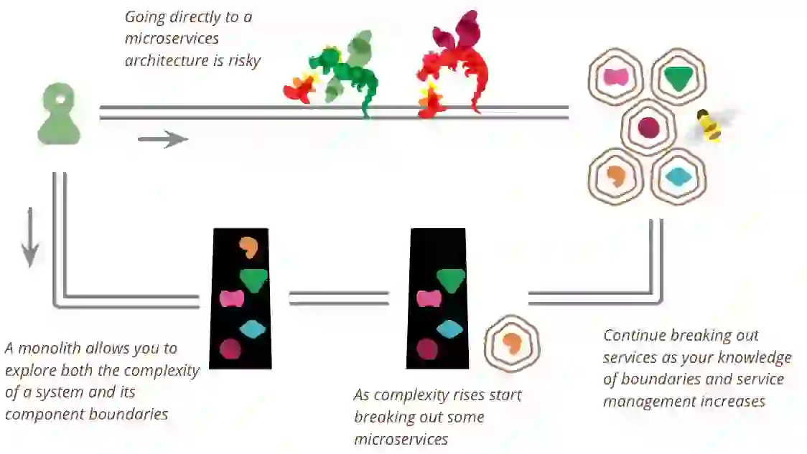

# 마이크로서비스 도입 안티패턴과 과제

from: https://martinfowler.com/bliki/MonolithFirst.html

- 마이크로서비스 아키텍처는 확장성, 민첩성, 유지보수성 향상 등 다양한 이점을 약속
- 하지만 많은 조직들이 마이크로서비스를 효과적으로 도입하는 데 어려움을 겪고 있음
- 마이크로서비스 도입 시 흔히 발생하는 안티패턴과 과제들을 살펴보고, 조직들이 함정을 피하고 마이크로서비스 여정에서 성공할 수 있도록 통찰을 제공

## `마이크로서비스를 목표`로 삼는 안티패턴

가장 흔한 안티패턴 중 하나는 **마이크로서비스 도입 자체를 목표로** 삼는 것
많은 조직들이 마이크로서비스가 왜 필요한지, 비즈니스 목표와 어떻게 연계되는지 명확히 이해하지 못한 채 서둘러 도입하려고 함
**결과:**

- 불필요한 복잡성으로 인한 자원 낭비
- 측정 가능한 이점 부족
- 시스템 성능과 안정성 저하 가능성

**해결책:**

- 마이크로서비스 고려 전 비즈니스 목표를 명확히 정의
- 특정 요구사항에 마이크로서비스가 최선의 해결책인지 평가
- 실질적인 이점을 제공하는 영역에만 마이크로서비스 구현

## 조직의 준비 부족

- 조직의 준비 부족은 마이크로서비스 도입의 성공을 방해하는 "암흑물질 같은 힘"으로 볼 수 있음
- 많은 조직들이 마이크로서비스를 효과적으로 구현하고 관리하는 데 필요한 문화, 기술, 관행이 부족

**조직 준비의 핵심 측면:**

1. **엄격한 설계 기술:** 개발자들은 잘 정의된 서비스 경계와 API를 만들기 위한 강력한 소프트웨어 설계 기술을 갖춰야 ㅎ함
2. **학습 문화:** 마이크로서비스 도입에는 실험과 학습이 수반되므로, 조직은 변화를 수용하고 실패를 용인하는 문화가 필요합니다.
3. **DevOps와 팀 토폴로지:** 성공적인 마이크로서비스 구현을 위해서는 DevOps 관행을 채택하고 느슨하게 결합된 자율적인 개발을 위한 팀 구성이 필요합니다.

**해결책:**

- 필요한 기술을 갖추기 위한 교육과 멘토링에 투자
- 학습과 실험을 장려하는 생성적 문화 조성
- 마이크로서비스를 지원하는 DevOps 관행과 팀 구조 도입에 전념

## `기술에만 집중`하는 안티패턴

- 또 다른 흔한 안티패턴은 마이크로서비스의 기술적 측면, 특히 배포 인프라에 과도하게 집중하는 것
- 이는 종종 근본적인 아키텍처와 조직적 과제를 해결하지 않은 채 복잡한 도구와 플랫폼에 조기 투자하는 결과를 초래

**결과:**

- 차별화되지 않은 과도한 작업
- 잠재적으로 부적합한 기술에 조기 투자
- 중요한 서비스 설계와 API 고려사항 소홀

**해결책:**

- 먼저 서비스 분해와 정의에 집중
- 초기 서비스를 지원하기 위한 최소한의 인프라 구축
- 경험이 쌓임에 따라 기술 스택을 점진적으로 발전

## `더 많을수록 좋다`는 안티패턴

"더 많을수록 좋다"는 안티패턴은 조직이 서비스가 많을수록 항상 더 좋다고 잘못 믿어 지나치게 세분화된 마이크로서비스 아키텍처를 만들 때 발생

**결과:**

- 개발, 테스트, 배포의 복잡성 증가
- 서비스 내부의 복잡성이 서비스 간 복잡성으로 이동
- 동시 변경이 필요한 밀접하게 결합된 서비스 발생 가능성

**해결책:**

- 기본적으로 팀당 하나의 서비스로 시작
- 특정 문제를 해결할 때만 추가 서비스 정의
- 서비스나 팀이 관리하기 너무 커지면 분할

## `걷기도 전에 날려고` 하는 안티패턴

이 안티패턴은 기본적인 소프트웨어 개발 관행을 먼저 숙달하지 않은 채 마이크로서비스를 도입하려는 시도를 뜻함

**핵심 기본 사항:**

- 클린 코드
- 자동화된 테스팅
- 좋은 설계 관행 (예: OOD, DDD)

**결과:**

- 잘못 설계된 마이크로서비스 아키텍처
- 테스트 자동화 부족으로 인한 안정성 문제
- 소프트웨어를 빠르고 자주 제공하는 능력 감소

**해결책:**

- 클린 코드 관행 수용 및 강제
- 개발의 핵심 부분으로 자동화된 테스팅 구현
- 도메인 주도 설계와 같은 영역의 설계 기술 교육에 투자

## `산발적 도입` 안티패턴

산발적 도입은 일관된 전략이나 로드맵 없이 마이크로서비스를 무계획적으로 구현하는 것을 뜻함

**결과:**

- 조직 전체의 일관성 없는 아키텍처
- 다양한 마이크로서비스 구현 관리와 유지보수의 어려움
- 기술 부채 증가와 통합 과제 발생 가능성

**해결책:**

- 비즈니스 목표에 부합하는 명확한 마이크로서비스 도입 전략 수립
- 마이크로서비스로의 점진적, 통제된 마이그레이션을 위한 로드맵 작성
- 조직 전체의 마이크로서비스 개발을 위한 표준과 모범 사례 수립

## `엔드-투-엔드 테스팅 함정`

마이크로서비스 아키텍처에서 엔드-투-엔드 테스팅에 과도하게 의존하면 "분산 모놀리스"를 초래하고 마이크로서비스의 많은 이점을 상쇄할 수 있음

**결과:**

- 테스팅 병목으로 인한 배포 빈도 감소
- 테스트의 복잡성과 취약성 증가
- 서비스의 독립적 배포 가능성 상실

**해결책:**

- 서비스 수준 테스팅과 계약 테스트에 집중
- 독립적으로 배포 및 테스트 가능한 서비스 설계
- 엔드-투-엔드 테스트는 중요한 사용자 여정에 한해 제한적으로 사용

## 결론

마이크로서비스 아키텍처 도입은 상당한 이점을 제공할 수 있지만, 신중한 계획, 준비, 실행이 필요
이러한 흔한 안티패턴을 피하고 조직적, 기술적 과제를 해결함으로써 기업은 마이크로서비스 도입 성공 가능성을 높일 수 있음
#### 주요 시사점:

1. 마이크로서비스 도입을 명확한 비즈니스 목표와 연계
2. 문화적, 기술적으로 조직을 준비
3. 기술보다 서비스 설계와 분해에 먼저 집중
4. 관리 가능한 수의 서비스로 시작하여 점진적으로 발전
5. 기본적인 소프트웨어 개발 관행 숙달
6. 일관된 도입 전략과 로드맵 개발
7. 광범위한 엔드-투-엔드 테스팅보다 서비스 수준 테스팅 우선

## ref

- [Anti-pattern: microservices as the goal](https://microservices.io/post/antipatterns/2019/01/14/antipattern-microservices-are-the-goal.html)
- [Is organizational unpreparedness a dark matter force?](https://microservices.io/post/refactoring/2023/07/25/dark-matter-force-organizational-unpreparedness.html)
- [Microservices adoption anti-pattern: Focussing on technology](https://microservices.io/post/antipatterns/2019/04/30/antipattern-focus-on-technology.html)
- [Microservices adoption anti-pattern: More the merrier](https://microservices.io/post/antipatterns/2019/05/21/antipattern-more-the-merrier.html)
- [Microservices adoption anti-pattern: Red flag law](https://microservices.io/post/antipatterns/2019/06/07/antipattern-red-flag-law.html)
- [Microservices adoption anti-pattern: scattershot adoption](https://microservices.io/post/antipatterns/2019/02/25/antipattern-scattershot-adoption.html)
- [Microservices adoption anti-pattern: Trying to fly before you can walk](https://microservices.io/post/antipatterns/2019/04/09/antipattern-flying-before-walking.html)
- [Microservices adoption anti-patterns: microservices are a magic pixie dust](https://microservices.io/post/antipatterns/2019/01/07/microservices-are-a-magic-pixie-dust.html)
- [Microservices adoption antipatterns](https://microservices.io/microservices/antipatterns/-/the/series/2019/06/18/microservices-adoption-antipatterns.html)
- [Potholes in the road from monolithic hell - Microservices adoption anti-patterns](https://microservices.io/microservices/general/2018/11/04/potholes-in-road-from-monolithic-hell.html)
- [Services + End-to-End Testing = ?](https://microservices.io/post/architecture/2024/03/29/services-with-end-to-end-testing-equals-monolith.html)
- [STOP hurting yourself by doing big bang modernizations!](https://microservices.io/post/architecture/2024/06/27/stop-hurting-yourself-by-doing-big-bang-modernizations.html)
- [The microservice architecture is meant to simplify and accelerate development, but only when done correctly](https://microservices.io/post/architecture/2023/07/06/msa-is-meant-to-simplify-development.md.html)
