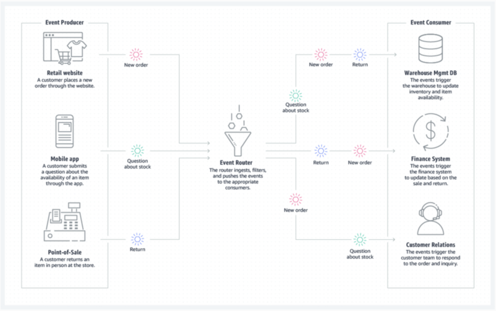
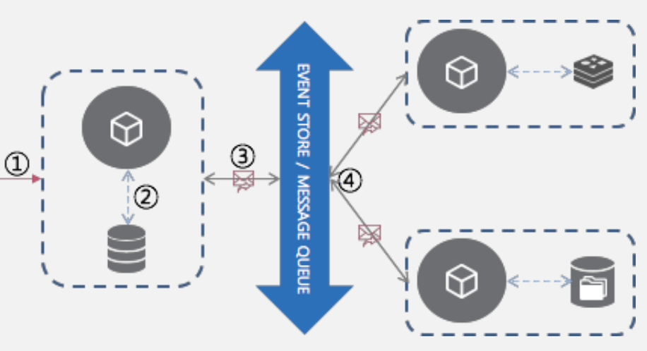
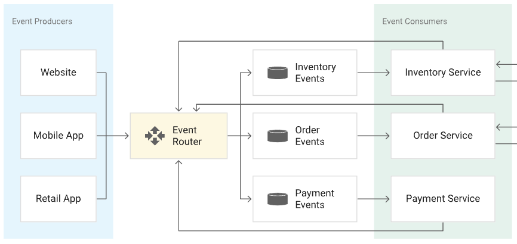

# 이벤트 기반 아키텍처(Event Driven Architecture)

### 1. 의도(Intent)

이벤트 기반 아키텍처는 분산된 시스템 간 이벤트를 생성, 발행하고 발행된 이벤트를 필요로 하는 수신자에게 전송하고 이벤트를 수신한 수신자가 이벤트를 처리하는 형태의 시스템 아키텍처입니다.

EDA의 목적은 **분산 시스템**에서 발생하는 복잡한 데이터 흐름을 처리하고, 각 구성 요소가 이벤트에 따라 독립적으로 반응함으로써, 시스템의 확장성을 확보하고 복잡성을 줄이는 것입니다.

### 이벤트 기반 마이크로서비스

**Event Driven MicroService**란,
MSA가 적용된 시스템에서 이벤트 발생시 해당 이벤트 로그를 보관하고 이를 기반으로 동작하며, 비동기 통신을 통해 시스템 내 통합을 수행하는 아키텍처입니다.

### 2. 문제 (Problem)

전통적인 **동기적 아키텍처**(모놀리식 구조나 RESTful API 기반 아키텍처)는 다음과 같은 문제를 가지고 있었습니다:

- **높은 결합도**: 서비스 간의 직접적인 호출로 인해, 각 서비스가 서로 강하게 결합되어 있어 유지보수와 확장이 어렵습니다.
- **확장성의 한계**: 대규모 트래픽 증가나 다양한 이벤트 처리가 필요한 경우, 동기적 요청-응답 방식은 병목 현상을 야기하며 확장성이 떨어집니다.
- **가용성 문제**: 특정 서비스가 다운되면, 다른 서비스도 영향을 받는 경우가 많아 전체 시스템의 안정성에 문제가 발생합니다.

### 3. 해결법 (Solution)

**이벤트 기반 아키텍처**는 이러한 문제들을 해결하기 위해 **비동기적 이벤트 처리** 방식을 도입했습니다. 각 서비스는 서로 **직접 통신하지 않고**, 특정 이벤트가 발생했을 때 **이벤트 브로커**(메시지 큐, Pub/Sub 시스템 등)를 통해 이벤트를 발행하고, 다른 서비스가 이를 **구독**하는 방식으로 동작합니다.

특징은 다음과 같습니다.

- **느슨한 결합**을 유지하여 서비스 간 의존성을 최소화할 수 있습니다.
- 각 서비스는 독립적으로 확장 가능하고, 이벤트가 발생할 때만 처리되므로 **효율적인 자원 사용**이 가능합니다.
- 이벤트가 발생하면 각 서비스가 **비동기적**으로 이벤트를 처리하므로 서비스가 대기하지 않고, 전체 시스템의 **성능**과 **반응성**이 향상됩니다.

## 4. 아키텍처

EDA는 시스템 내에서 발생하는 이벤트를 기반으로 상호작용하는 아키텍처 스타일입니다. 이벤트는 상태 변화나 작업의 발생을 의미하며, 시스템의 컴포넌트는 이벤트를 생성하거나 이를 소비(구독)하여 비동기적으로 동작합니다.

**구성 요소**

- **Event Producers (이벤트 생성자)**: 이벤트를 발생시키는 주체. 시스템 내에서 상태 변화가 발생할 때 이벤트를 생성하여 전달합니다. 예를 들어, 사용자가 상품을 구매하면 구매 이벤트가 생성됩니다.
- **Event Consumers (이벤트 소비자)**: 이벤트를 구독하고, 해당 이벤트가 발생할 때 특정 작업을 수행하는 주체입니다. 소비자는 여러 이벤트를 동시에 구독할 수 있습니다.
- **Event Channel**: 이벤트가 전송되는 경로로, 메시지 브로커(예: Kafka, RabbitMQ) 등이 이벤트를 중개합니다. 이를 통해 이벤트가 생성자에서 소비자에게 전달됩니다.
- **Event Stream Processing**: 실시간으로 이벤트 스트림을 처리하며, 이벤트를 실시간으로 분석하고 반응하는 프로세스입니다.

## 5. 장단점

- **장점**:
    - **비동기 처리**: 서비스들이 비동기적으로 이벤트를 주고받기 때문에, 시스템이 느린 서비스나 장애 서비스에 종속되지 않고 유연하게 동작할 수 있습니다.
    - **확장성**: 새로운 이벤트 소비자를 추가하거나 제거하는 것이 용이해 확장성과 유연성을 확보할 수 있습니다.
    - **실시간 반응**: 이벤트가 발생하는 즉시 반응할 수 있어, 실시간 처리 및 대응이 가능합니다.
    - **느슨한 결합**: 서비스 간 의존성이 낮아져 변경 사항이 있더라도 시스템 전체에 영향을 주지 않으며, 서비스 독립성이 높아집니다.
- **단점**:
    - **복잡성 증가**: 시스템 내에서 발생하는 이벤트의 흐름을 파악하고 관리하는 것이 어려워질 수 있으며, 디버깅 및 트러블슈팅이 복잡해집니다.
    - **데이터 일관성 문제**: 비동기적으로 데이터가 처리되기 때문에, 데이터의 일관성을 즉시 보장하기 어렵습니다. 결국 분산 트랜잭션 관리가 필요할 수 있습니다.
    - **메시지 중개 시스템 의존**: 이벤트를 처리하기 위한 메시지 브로커나 이벤트 스트림 처리 시스템의 설정과 관리가 필요하며, 추가적인 인프라 비용이 발생할 수 있습니다.
    - **순서 보장 문제**: 이벤트 처리 순서를 보장하는 데 추가적인 설계와 노력이 필요할 수 있습니다.

## 6. 다른 기술과의 관계

- **메시지 브로커**: 이벤트 기반 아키텍처는 메시지 브로커와 밀접하게 연관되어 있습니다. Kafka, RabbitMQ와 같은 메시지 브로커는 이벤트 생성자와 소비자 간의 비동기 통신을 가능하게 하고, 이벤트 전송, 큐잉, 스트리밍을 처리합니다.
- **마이크로서비스 아키텍처(MSA)**: EDA는 MSA와 함께 자주 사용됩니다. MSA에서 각 서비스는 독립적으로 동작하며, 이벤트를 통해 서로 통신할 수 있습니다. 이로써 마이크로서비스 간의 느슨한 결합을 유지하고 유연성을 극대화할 수 있습니다.
- **클라우드 컴퓨팅**: EDA는 클라우드 환경과 잘 어울립니다. AWS의 Lambda와 SQS, Azure Event Grid, Google Pub/Sub과 같은 클라우드 서비스는 이벤트 기반 애플리케이션을 쉽게 구축할 수 있는 도구와 플랫폼을 제공합니다.
- **서버리스(Serverless)**: 서버리스 환경에서 이벤트 기반 아키텍처가 자주 사용됩니다. 서버리스 함수는 이벤트가 발생했을 때 실행되므로, 이벤트 기반으로 유연하게 애플리케이션을 확장할 수 있습니다.
- **데이터 스트림 처리**: Apache Kafka Streams, Apache Flink 같은 스트리밍 데이터 처리 도구는 EDA에서 실시간으로 이벤트 스트림을 분석하고 처리하는 데 사용됩니다.

## 7. 레퍼런스

- https://aws.amazon.com/ko/what-is/eda/
- https://cloud.google.com/eventarc/docs/event-driven-architectures?hl=ko
- https://f-lab.kr/insight/understanding-event-driven-architecture
- https://aws.amazon.com/ko/event-driven-architecture/
