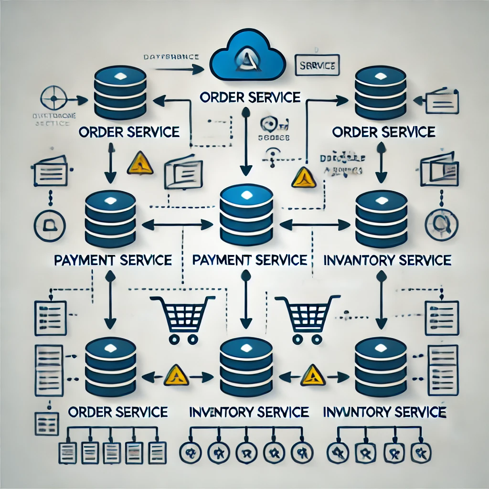
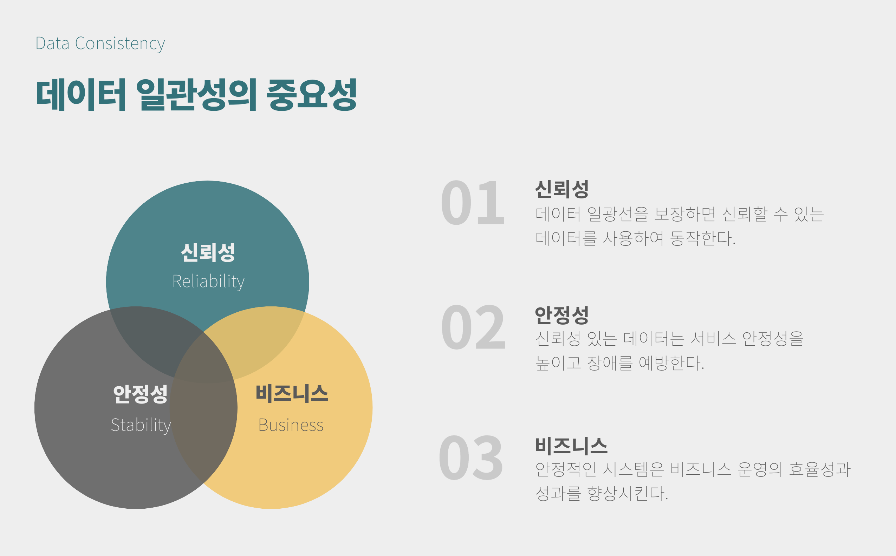
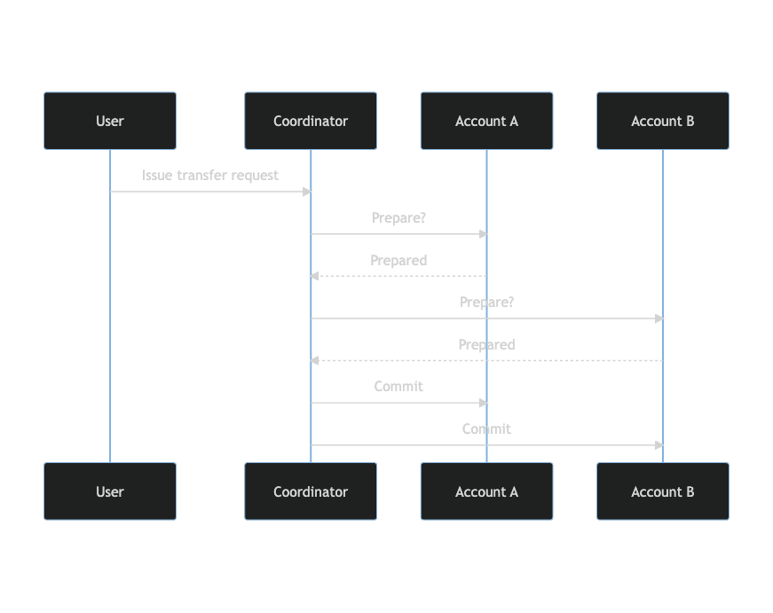
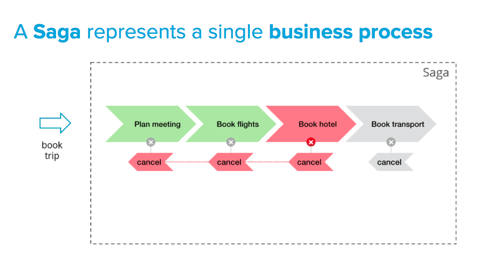
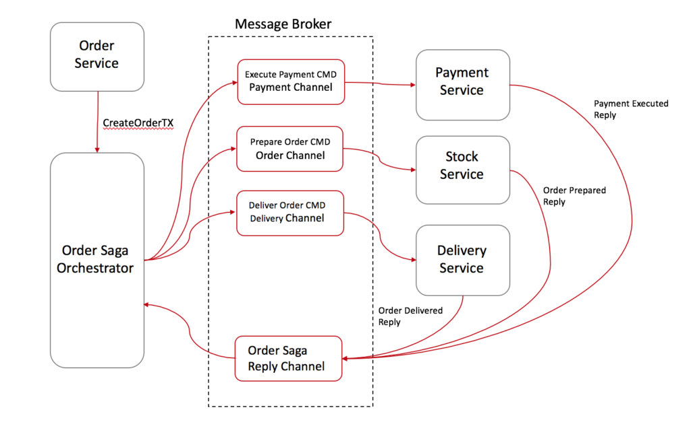
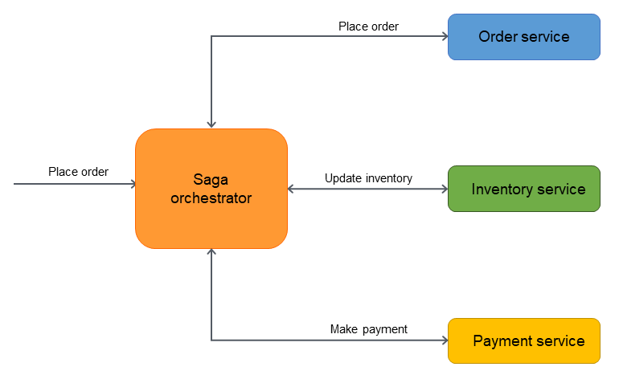

# 데이터 일관성(Data Consistency)



### 데이터 불일치로 인한 서비스 장애

- 서비스 간의 데이터 불일치가 발생할 경우 각 서비스가 서로 다른 정보를 바탕으로 동작하게 되어, 결제나 주문 같은 중요한 트랜잭션에 문제가 발생할 수 있다.

### 사용자 경험의 일관성 유지

- 사용자는 각 서비스에서 일관된 정보를 기대한다.

## 데이터 일관성의 중요성



## 데이터 일관성 유지 방법

### 2PC(Phase Commit) 패턴



- 아래 코드는 유저가 계좌 A에서 계좌 B로 자금을 이체하는 예제이다.

```java
public interface BankService {
    void prepareTransfer(int amount);
    void commit();
    void rollback();
}

@Component
public class AccountAService implements BankService {

    // 계좌 A에서 금액을 차감하기 전의 준비 작업(계좌호출 차감 금액 확인등..)
    @Override
    public void prepareTransfer(int amount) {
        if(balance >= amount) {
            balance -= amount;
            return true;
        } else {
            return false; // 잔액 부족
        }
    }
}

@Component
public class AccountBService implements BankService {

	// 계좌 B로 입금하기 전의 준비 작업(입금 계좌 확인 및 금액 확인 등..)
    @Override
    public void prepareTransfer(int amount) {
        balance += amount;
        return true;
    }
}

@Service
@RequiredArgsConstructor
public class TransferService {

    private final AccountAService accountA;
    private final AccountBService accountB;

    public void transfer(int amount) {
        boolean isPrepared = accountA.prepareTransfer(amount) && accountB.prepareTransfer(amount);

        if (isPrepared) {
            accountA.commit();
            accountB.commit();
        } else {
            accountA.rollback();
            accountB.rollback();
        }
    }
}
```

- Prepare Phase :
	- 트랜잭션 매니저(TM)가 모든 리소스 매니저(RM)에게 트랜잭션 커밋 준비를 요청한다.
	- 각 RM은 해당 요청을 받아 필요한 작업을 준비한 후, 준비 완료를 TM에게 알린다.

- Commit & Rollback Phase :
	- 모든 RM이 준비 완료를 통보하면 TM은 트랜잭션을 커밋한다.
	- 이때 준비되지 않은 RM이 있는 경우 TM은 트랜잭션을 롤백한다.

###  SAGA 패턴



- 아래 코드는 SAGA 패턴을 이용해 주문, 결제, 배송 서비스를 관리하는 예제이다.

```java
class OrderService {
    public void createOrder(Order order) {
        try {
            // 주문 생성 로직
            orderRepository.save(order);
            // 결제 서비스 호출
            paymentService.processPayment(order);
        } catch (Exception e) {
            // 롤백 로직
            orderRepository.delete(order);
            throw e;
        }
    }
}

class PaymentService {
    public void processPayment(Order order) {
        try {
            // 결제 처리 로직
            paymentRepository.save(order);
            // 배송 서비스 호출
            shippingService.shipOrder(order);
        } catch (Exception e) {
            // 롤백 로직
            paymentRepository.delete(order);
            throw e;
        }
    }
}
```

- SAGA 패턴은 각 서비스가 독립적으로 트랜잭션을 처리하고, 트랜잭션이 완료되면 다음 서비스로 이벤트를 전달하는 방식이다.
- 만약 트랜잭션이 실패하면, 이전 서비스로 롤백 이벤트를 전달하여 상태를 복구한다.

#### Choreography ➡️ 분산



- 각 서비스가 독립적으로 이벤트에 반응하여 다음 작업을 수행하는 방식이다.
- 각 서비스는 다른 서비스에서 발생한 이벤트를 감지하고, 그에 따라 자신이 해야 할 작업을 처리한다.

#### Orchestration ➡️ 집중



- 중앙의 오케스트레이터가 트랜잭션의 전체 흐름을 관리하며, 각 서비스에게 명령을 내려 트랜잭션을 처리하는 방식이다.

### 이벤트 소싱

- 아래 코드는 이벤트 소싱을 이용해 주문과 결제 서비스를 관리하는 예제이다.

```java
class OrderService {
    public void createOrder(Order order) {
        // 주문 생성 이벤트 생성
        OrderCreatedEvent event = new OrderCreatedEvent(order);
        // 이벤트 스토어에 저장
        eventStore.save(event);
        // 이벤트 브로커를 통해 이벤트 전파
        eventBroker.publish(event);
    }
}

class PaymentService {
    public void onOrderCreated(OrderCreatedEvent event) {
        // 결제 처리 로직
        Payment payment = new Payment(event.getOrder());
        paymentRepository.save(payment);
        // 결제 완료 이벤트 생성
        PaymentCompletedEvent paymentEvent = new PaymentCompletedEvent(payment);
        // 이벤트 스토어에 저장
        eventStore.save(paymentEvent);
        // 이벤트 브로커를 통해 이벤트 전파
        eventBroker.publish(paymentEvent);
    }
}
```

- 이벤트 소싱은 데이터의 상태를 이벤트 시퀀스로 저장하고, 이를 통해 현재 상태를 재구성하는 방식이다.
- 이러한 방식은 데이터 변경 이력을 모두 기록하므로 데이터 일관성을 유지할 수 있다.
- 이벤트 소싱의 과정은 다음과 같습니다 :
	- 각 서비스가 이벤트를 생성한다.
	- 생성된 이벤트를 이벤트 스토어에 저장한다.
	- 다른 서비스는 이벤트 스토어에서 이벤트를 읽어와 자신의 상태를 업데이트한다.
	- 이 과정을 통해 여러 서비스 간의 데이터 일관성을 유지한다.

### ETC

- 일관성 모델
	- 즉각적 일관성
	- 최종적 일관성
	- 하이브리드 일관성

- CQRS(Command Query Responsibility Segregation) 패턴
	- 명령(C, U, D)
	- 조회(R)

- CDC(Change Data Capture) 패턴
**정의**:
  - 데이터베이스의 변경 사항을 실시간으로 감지하고 캡처하는 기술/패턴입니다.
  - 데이터의 추가, 수정, 삭제 등 변경 사항을 추적하고 이를 다른 시스템에 전달합니다.

**목적**:
- 데이터의 실시간 동기화 및 일관성 유지
- 시스템 간 데이터 통합 및 복제
- 실시간 분석, 이벤트 기반 아키텍처 구현 등에 활용

**작동 방식**:
- 주로 데이터베이스의 트랜잭션 로그를 모니터링하여 변경 사항을 캡처
- 캡처된 변경 사항을 이벤트 스트림 형태로 다른 시스템에 전달

**장점**:
- 실시간 데이터 처리 가능
- 시스템 간 낮은 결합도 유지
- 데이터베이스 성능에 미치는 영향 최소화

**활용 사례**:
- 마이크로서비스 간 데이터 동기화
- 데이터 복제 및 백업
- 실시간 분석 및 보고
- 감사 및 규정 준수

**구현 도구**:
- Debezium, Kafka Connect 등의 오픈소스 도구 활용 가능

### 참고 자료

- [2PC & SAGA 패턴](https://velog.io/@ch200203/MSA-환경에서의-분산-트랜잭션-관리2PC-SAGA-패턴)
- [이벤트 소싱 패턴](https://f-lab.kr/insight/maintaining-data-consistency-in-microservices-architecture-20240803)
- [CQRS 패턴](https://junuuu.tistory.com/891)
- [CDC 패턴](https://www.redhat.com/ko/topics/integration/what-is-change-data-capture)
- [일관성 모델](https://velog.io/@jm1225/MSA-Database-Consistency)
