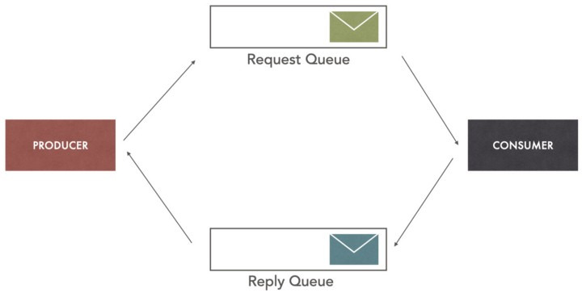
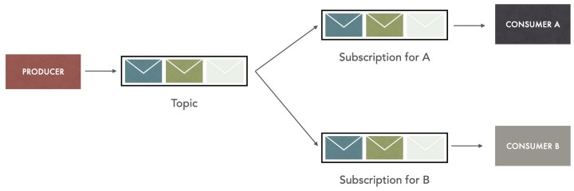
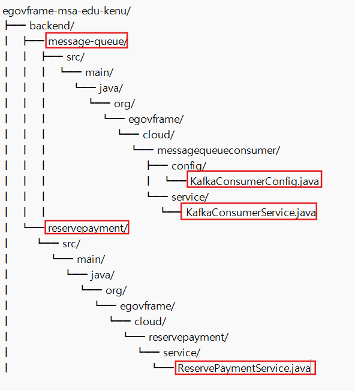
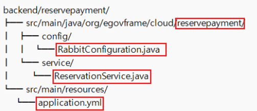
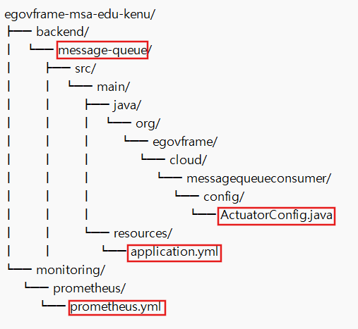

# 메시지 큐(Message Queue)

## 0. 메시지 지향 미들웨어(MOM: Message Oriented Middleware)

응용소프트웨어 간의 비동기적 데이터 통신을 위한 소프트웨어로, 사용 시 다음과 같은 장점을 가집니다:

- 메시지의 백업 기능을 유지함으로 지속성을 제공하기에 송수신 측은 동시에 네트워크 연결을 유지할 필요가 없습니다.
- 메시지 라우팅을 수행하기에 하나의 메시지를 여러 수신자에게 배포가 가능합니다.
- 송수신 측의 요구에 따라 전달하는 메시지를 변환할 수 있습니다.

## 1. 메시지 큐

큐 자료구조를 채택해서 메시지를 전달하는 시스템이며, 메시지 지향 미들웨어(MOM)를 구현한 시스템입니다.

메시지 큐는 메시지를 발행하고 전달하는 부분인`Producer`와 메시지를 받아서 소비하는 부분인 `Consumer` 사이의 메시지 전달 역할을 하는 매개체입니다.

## 2. 메시지 큐의 종류
| 이름 | 특징 | 사용 시나리오 | 사용 예시 |
|------|------|---------------|-----------|
| Kafka | • 초고속 대용량 데이터 처리에 특화<br>• 데이터 유실 방지를 위한 복제 기능<br>• 확장이 용이한 분산 시스템 구조 | • 대용량 실시간 로그 및 이벤트 처리<br>• 스트림 처리 애플리케이션 | • LinkedIn: 사용자 활동 추적 및 로그 관리<br>• Netflix: 실시간 추천 시스템 및 모니터링 |
| RabbitMQ | • 다양한 메시징 방식 지원(1대1, 1대다 등)<br>• 유연한 라우팅으로 복잡한 메시지 흐름 처리 가능 | • 복잡한 라우팅이 필요한 워크플로우<br>• 다양한 시스템 간 연동 필요 시 | • Mozilla: 데이터 동기화 및 알림 시스템 |
| ActiveMQ | • JMS 완벽 지원<br>• 다양한 언어 및 프로토콜 지원 | • JAVA 기반 엔터프라이즈 애플리케이션<br>• 다중 프로토콜 지원이 필요한 환경 | • Amazon: 주문 처리 시스템 일부 |
| Redis | • 인메모리 데이터 구조로 빠른 처리 속도<br>• 단순하고 가벼운 메시징 시스템 | • 실시간 알림 시스템 구축 시<br>• 낮은 지연 시간, 처리 속도 중요 시 | • Twitter: 실시간 타임라인 업데이트 |

## 3. 메시지 브로커 VS 이벤트 브로커

메시지 큐에서 데이터를 운반하는 방식에 따라 메시지 브로커와 이벤트 브로커로 나눌 수 있습니다.

### 메시지 브로커

- Consumer가 메시지 큐에서 데이터를 가져가면 짧은 시간 내에 메시지 큐에서 데이터가 삭제됩니다.
- 일회성 작업에 대한 메시지를 다룹니다.
- 하나의 Consumer가 메시지를 처리할 수 있게 함으로써 `One-way Messaging`이나 `Request/Response Messaging`패턴에 적합합니다.
- ex) RabbitMQ, ActiveMQ, AWS SQS, Redis(Queue)

### 이벤트 브로커

- Consumer가 메시지 큐에서 데이터를 가져가도 삭제되지 않으며, 필요한 경우 재사용할 수 있습니다.
- 여러 Consumer가 동일한 메시지를 독립적으로 처리할 수 있게 함으로써 `Pub/Sub`패턴에 적합합니다.
- 메시지 브로커보다 대용량 데이터를 처리할 수 있는 능력이 있습니다.
- ex) Apache Kafka, Apache Pulsar, Redis(Pub/Sub)

## 4. 메시징 패턴
### One-way Messaging

- point-to-point messaging
- `Producer`는 `Consumer`가 특정 시점에 메시지 검색하고 처리할 것을 기대하고 Queue에 메시지를 보냅니다
- `Consumer`는 `Queue`에서 메시지를 검색하고 처리하며, 여기서 `Producer`는 `Consumer`의 존재나 메시지가 어떻게 process 되는지 알지 못하며 `Consumer`의 응답을 기다리지 않습니다. 즉 `Consumer`에 응답에 의존적이지 않습니다.

### Request/Response Messaging

- `Consumer`가 Response message를 보낼 별도의 Message Queue 형태의 Communication channel이 필요합니다
- `Producer`는 Reuqest Queue에 메시지를 보낸 뒤 Reply Queue로부터 Response를 기다립니다.
- `Consumer`는 메시지를 처리한 다음에 Reply Queue에 Response 메시지를 전달합니다
- 만약 Response가 설정해 놓은 time interval 안에 도착하지 않는다면 Producer는 둘 중 하나를 선택할 수 있습니다:
  - 메시지를 다시 보냅니다
  - Timeout 처리를 합니다


### Pub/Sub

- `Publisher`는 Topic에 메시지를 발행하고, 누가 받는지는 알 필요가 없습니다
- `Subscriber`는 관심있는 Topic을 구독하고, 해당 Topic에 발행된 모든 메시지를 수신합니다
- 하나의 메시지가 여러 `Subscriber`에 전달될 수 있습니다(1:N)
- `Subscriber`는 언제든 구독을 시작하거나 중단할 수 있으며, `Publisher`의 동작에는 영향을 주지 않습니다.

---
# MSA에서의 메시지 큐와 모니터링

## 1. MSA에서 메시지 큐 구현 시 고려사항

MSA 환경에서 안정적이고 효율적인 비동기 통신을 실현하기 위해서는 메시지 큐를 구현할 때 다음 사항들을 고려해야 합니다

1. **메시지 포맷**: 메지시 큐에서는 일관된 메시지 구조와 직렬화 방식을 선택합니다. JSON이나 Protocol Buffers와 같은 표준화된 포맷을 사용하면 서비스 간 통신을 단순화할 수 있고 또한, 스키마 버전 관리를 통해 메시지 포맷의 변경을 유연하게 처리할 수 있습니다.
2. **메시지 순서**: 메시지 순서가 중요한 경우, 순서 보장 메커니즘을 구현해야 합니다. Kafka와 같은 메시지 브로커를 통해 파티션 내에서 메시지 순서를 보장하고 필요에 따라 시퀀스 번호나 타임스탬프를 메시지에 포함시켜 순서를 추적할 수 있습니다.
3. **멱등성**: 중복 메시지 처리에 대비한 멱등성 처리 로직을 구현하기위해 고유 식별자를 사용하여 메시지를 추적하고, 이미 처리된 메시지를 식별하여 중복 처리를 방지할 수 있습니다
4. **장애 처리**: 메시지 손실 방지와 재시도를 위해 데드 레터 큐(DLQ)를 사용하여 처리에 실패한 메시지를 저장하고 나중에 재처리할 수 있습니다. 또한, 메시지 브로커의 내구성 설정을 통해 메시지 손실을 최소화할 수 있습니다.
5. **확장성**: 메시지 양 증가에 대비한 확장 계획을 수립할 때에는 수평적 확장이 가능한 메시지 브로커를 선택하고, 컨슈머 그룹을 활용하여 병렬 처리 능력을 향상시킬 수 있습니다
6. **모니터링**: 큐 길이, 처리 속도, 오류율 등의 큐의 상태에 대한 지표를 실시간으로 추적하고, 이상 징후를 감지할 수 있는 알림 시스템을 구축해야 합니다
7. **보안**: 메시지 암호화 및 접근 제어를 구현하여 토픽 기반 라우팅이나 콘텐츠 기반 라우팅을 구현하여 메시지가 올바른 목적지에 도달하도록 해야 합니다

egovframe-msa 프로젝트에서는 Apache Kafka와 RabbitMQ 도구를 사용해서 큐 패턴을 적용하였습니다.

## 2. egovframe-msa 프로젝트의 메시지 큐 패턴 사례

## Apache Kafka를 사용한 메시지 큐 구현
egovframe-msa 프로젝트에서 Apache Kafka를 사용하여 예약 시스템의 메시지 큐를 구현하고 있습니다.
예약 시스템에서 생성된 메시지를 'reservationTopic'으로 전송하고, 이를 수신한 결제 서비스에서 처리 후 'paymentTopic'으로 결과를 전달하는 비동기 통신 구조를 구현했습니다.


### 디렉토리 구조


### 구현 코드

**KafkaConsumerConfig.java**
```
@Configuration
@EnableKafka
public class KafkaConsumerConfig {
    @Bean
    public ConsumerFactory<String, String> consumerFactory() {
        Map<String, Object> props = new HashMap<>();
        props.put(ConsumerConfig.BOOTSTRAP_SERVERS_CONFIG, "localhost:9092");
        props.put(ConsumerConfig.GROUP_ID_CONFIG, "group-id");
        props.put(ConsumerConfig.KEY_DESERIALIZER_CLASS_CONFIG, StringDeserializer.class);
        props.put(ConsumerConfig.VALUE_DESERIALIZER_CLASS_CONFIG, StringDeserializer.class);
        return new DefaultKafkaConsumerFactory<>(props);
    }

    @Bean
    public ConcurrentKafkaListenerContainerFactory<String, String> kafkaListenerContainerFactory() {
        ConcurrentKafkaListenerContainerFactory<String, String> factory = new ConcurrentKafkaListenerContainerFactory<>();
        factory.setConsumerFactory(consumerFactory());
        return factory;
    }
}
```
`KafkaConsumerConfig.java` 클래스에서는 Kafka 소비자 설정을 담당합니다.

**consumerFactory() 메소드**
- Kafka 소비자의 기본 설정을 정의합니다.
- BOOTSTRAP_SERVERS_CONFIG: Kafka 브로커의 주소를 설정합니다.
- GROUP_ID_CONFIG: 소비자 그룹 ID를 설정합니다.
- KEY_DESERIALIZER_CLASS_CONFIG, VALUE_DESERIALIZER_CLASS_CONFIG: 메시지 키와 값의 역직렬화 클래스를 지정합니다.

**kafkaListenerContainerFactory() 메소드:**
- @KafkaListener 어노테이션을 사용하는 메소드를 위한 컨테이너 팩토리를 생성합니다.


**KafkaConsumerService.java**
```
@Service
public class KafkaConsumerService {
    @KafkaListener(topics = "reservationTopic", groupId = "group-id")
    public void consume(String message) {
        System.out.println("Received message: " + message);
        // 메시지 처리 로직
    }
}
```

`KafkaConsumerService.java` 클래스는 Kafka로부터 메시지를 수신하고 처리합니다.
- `@KafkaListener`를 통해 지정된 토픽("reservationTopic")에서 메시지를 수신합니다.
- groupId로 소비자 그룹을 지정합니다.


**ReservePaymentService.java**
```
@Service
public class ReservePaymentService {
    @Autowired
    private KafkaTemplate<String, String> kafkaTemplate;

    public void processPayment(String reservationData) {
        // 결제 처리 로직
        kafkaTemplate.send("paymentTopic", reservationData);
    }
}
```
`ReservePaymentService.java` 클래스는 결제 처리 및 결과를 Kafka로 전송합니다.
- `@Autowired KafkaTemplate`을 통해 Kafka로 메시지를 전송하기 위한 템플릿을 주입받습니다.
- `processPayment()` 메소드로 결제 처리 로직을 구현하고 처리 결과를 `paymentTopic`으로 전송합니다.


## 3. RabbitMQ를 사용한 메시지 큐 구현
egovframe-msa 프로젝트에서 RabbitMQ를 사용하여 예약 시스템의 메시지 큐를 구현하고 있습니다.
예약이 생성되면 메시지가 RabbitMQ로 전송되고, 다른 서비스에서 이 메시지를 수신하여 처리하는 방식으로 MSA 환경에서 서비스 간 비동기 통신을 구현하여 시스템의 확장성과 유연성을 향상 시킵니다.

### 디렉토리 구조


**RabbitConfiguration.java**
```
@Configuration
public class RabbitConfiguration {

    @Bean
    public Queue queue() {
        return new Queue("reservationQueue", false);
    }

    @Bean
    public TopicExchange exchange() {
        return new TopicExchange("reservationExchange");
    }

    @Bean
    public Binding binding(Queue queue, TopicExchange exchange) {
        return BindingBuilder.bind(queue).to(exchange).with("reservation.#");
    }
}
```

`RabbitConfiguration.java` 클래스는 RabbitMQ를 위한 기본 설정을 제공합니다.
- `reservationQueue`라는 이름의 큐를 생성합니다.
- `reservationExchange`라는 이름의 토픽 교환기를 생성합니다.
- 큐와 교환기를 `reservation.#` 라우팅 키로 바인딩합니다.


**ReservationService.java**
```
@Service
@RequiredArgsConstructor
public class ReservationService {

    private final RabbitTemplate rabbitTemplate;

    public void sendReservationMessage(ReservationDto reservationDto) {
        rabbitTemplate.convertAndSend("reservationExchange", "reservation.created", reservationDto);
    }

    @RabbitListener(queues = "reservationQueue")
    public void receiveReservationMessage(ReservationDto reservationDto) {
        // 메시지 처리 로직
        System.out.println("Received reservation: " + reservationDto);
    }
}
```

`ReservationService.java` 클래스는 RabbitMQ를 통한 메시지 송수신을 담당합니다.
- `sendReservationMessage()` 메소드는 예약 정보를 RabbitMQ로 전송합니다.
- `receiveReservationMessage()` 메소드는 RabbitMQ로부터 메시지를 수신하고 처리합니다.


**application.yml**
```
spring:
  rabbitmq:
    host: localhost
    port: 5672
    username: guest
    password: guest
```
application.yml파일은 RabbitMQ 연결 정보를 제공합니다.


## 4. 메시지 큐와 모니터링
MSA아키텍처와 같은 대규모 분산 시스템이나 비동기 작업을 처리할 때 메시지 큐를 안정적으로 운영하기 위해 모니터링이 필수적입니다.

**성능 최적화**: 메시지 큐의 성능이 저하되면 지연(latency)이 발생하거나 메시지가 정상적으로 처리되지 않을 수 있수 있기 때문에 큐에 쌓인 메시지의 양, 처리 속도, 실패율 등을 모니터링함으로써 병목 구간을 파악하고 적절한 조치를 취할 수 있습니다.
<br>

**안정성 유지:**: 메시지 손실, 중복 처리, 지연 등의 문제가 발생할 수 있기 때문에, 메시지 큐가 제대로 작동하는지 모니터링하는 것이 중요합니다. 특히 RabbitMQ와 같은 큐에서는 메시지가 메모리나 디스크에 저장되는 방식을 모니터링해야 데이터 손실을 방지할 수 있습니다. 메시지 처리 상태와 에러율을 추적하면 문제가 발생했을 때 즉각적인 대응이 가능해집니다.
<br>

**장애 대응 및 복구** : 큐 자체가 장애가 나면 시스템 전반에 영향을 미칠 수 있습니다. 큐의 상태, 클러스터 노드 간 연결 상태, 네트워크 문제 등을 모니터링하면 장애를 사전에 방지하고 빠르게 복구할 수 있습니다. RabbitMQ의 경우 클러스터 상태, 큐 당 메시지 수, 리소스 사용량(CPU, 메모리 등)을 모니터링하여 장애에 대비할 수 있습니다.
<br>

**스케일링 및 자원 관리**: 트래픽이 급증할 때는 큐의 메시지 처리 속도와 서버 자원 사용량을 모니터링하여 적절한 스케일링 정책을 적용할 수 있습니다. 자원 관리 측면에서도 모니터링을 통해 과도한 리소스 사용이나 비효율적인 메시지 처리 과정을 감지할 수 있습니다.


## 5. egovframe-msa프로젝트의 모니터링 방법

egovframe-msa프로젝트에서는 Spring Boot Actuator와 Prometheus를 사용하여 모니터링을 구현하고 있습니다.

### 디렉토리 구조



**ActuatorConfig.java**
```
@Configuration
public class ActuatorConfig {
    @Bean
    public MeterRegistryCustomizer<MeterRegistry> metricsCommonTags() {
        return registry -> registry.config().commonTags("application", "message-queue-consumer");
    }
}
```


**#application.yml**
```
management:
  endpoints:
    web:
      exposure:
        include: health,info,metrics,prometheus
  metrics:
    export:
      prometheus:
        enabled: true
```

**prometheus.yml**
```
global:
  scrape_interval: 15s

scrape_configs:
  - job_name: 'spring-actuator'
    metrics_path: '/actuator/prometheus'
    static_configs:
      - targets: ['localhost:8080']
```


이 설정을 통해 Spring Boot Actuator는 애플리케이션의 상태, 메트릭 등을 노출하고, Prometheus는 이를 수집하여 모니터링하고 있습니다. 이떄 Grafana와 같은 도구를 추가로 사용하면 수집된 데이터를 시각화할 수 있습니다.
